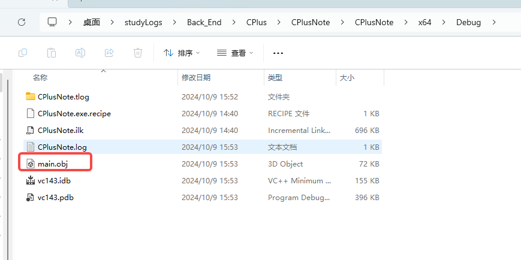
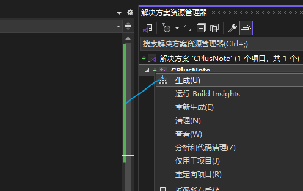
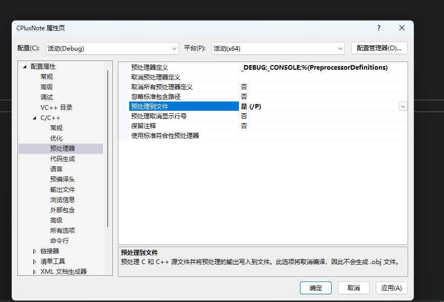
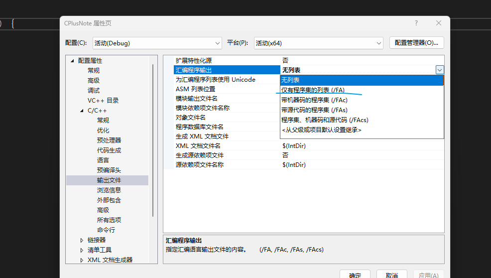
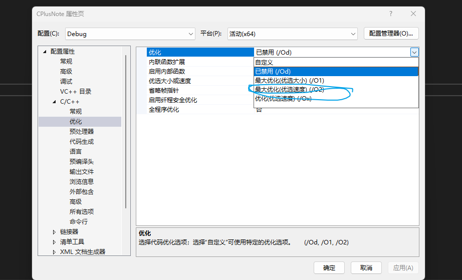
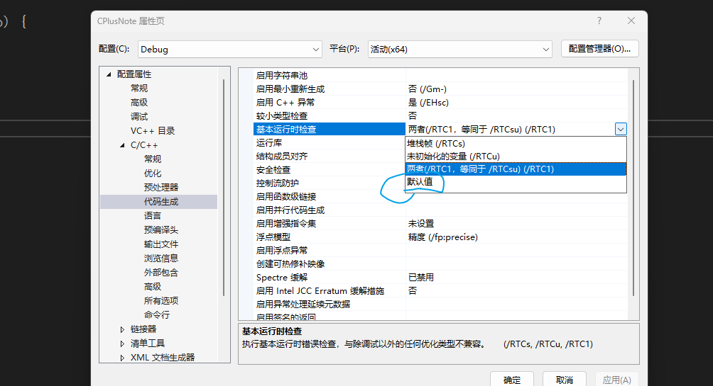
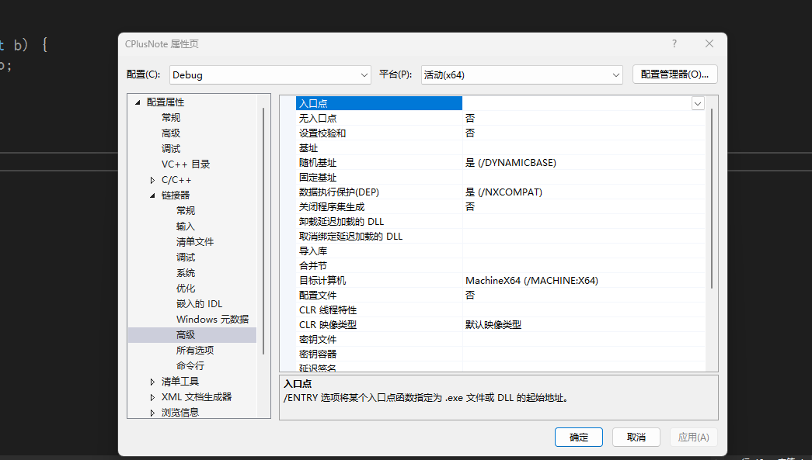

# C++学习
#号后面的就是预处理语句
他在实际编译发生之前就被处理了
```c++
#include <iostream>

``` 

std::cin.get(); 代表程序暂时停到这里，必须键入回车才会执行下面的代码

cpp所有文件都会被编译 但是头文件不会，因为头文件的内容在预处理时包含了进来
cpp编译后会生成.obj文件，然后会把多个.obj文件合并成一个执行文件.exe 也就是link

ctrl+F7 是编译指令，但是这个是单独编译一个文件，不会进行link连接
然后打开在文件夹管理中打卡文件会发现有.obj文件



这个生成是对整个项目进行编译，会进行link 结果生成.exe文件

main.cpp
```c++

#include <iostream>


//进行函数的声明
void Log(const char* message);  //函数声明的那个参数 可以随便写 甚至不写都可以

int main() {

	Log("hello world");
	std::cin.get();


	return 0;

}

```
log.cpp
```c++
#include<iostream>


void Log(const char* message) {
	std::cout << message << std::endl;
}
```

main.cpp居然可以调用log.cpp中的方法 仅需一个函数声明

这就是link的作用，在build的时候，所有cpp文件都会被编译,连接器会找到正确的log函数定义在哪里
当我们在log.cpp中把函数名字改了 回到main.cpp中 单独编译main.cpp是没问题的，
但是要整体build，就会报错，链接错误，找不到函数
会报无法解析的外部符号，指的是链接器无法解析这个符号，链接器的作用是链接函数


## C++编译器如何工作
从文本形式到实际可执行的二进制文件   预处理我们的代码，意味着所有的预处理器语句都会先处理，然后把整个c++内容 整理为抽象语法树，然后开始生产实际代码（机器可执行的代码）
有两个主要的操作需要进行
1. 编译（会生成.obj文件）
       编译的第一个阶段：预处理阶段的处理，#include为例 会把里面的内容复制到源文件里
例子 math.cpp
```c++

int Multiply(int a, int b) {
	int  result = a * b;
	return result;
#include "EndBrace.h"
```
EndBrace.h   他真的只有个右大括号
```c++
}
```

然后编译math.cpp你会发现真的编译成功了 毫无问题


#define INTEGER int   会把int替换为INTEGER    #if 1   #endif // 1 也是个预处理语句
```c++

#define INTEGER int 


#if 1
INTEGER Multiply(int a, int b) {
	INTEGER  result = a * b;
	return result;
}
#endif // 1


```

这个配置修改后就可以看到预处理后的文件内容，但是就不会生成.obj文件了 注意  这个叫预处理到文件，不是编译操作，还没走到编译操作呢

编译后生成的obj文件 里面都是二进制内容，不可读的 但是我们配置一个东西 

会生成ams文件，这个文件是我们程序员可读的，但是汇编语言
但是明显是没有优化的

开启后如果报错，报错是因为code检查配置 可以按照下面修改配置 ，然后再编译原来的cpp文件 会发现内容少了，汇编效率也搞了

2. 链接

这里可以设置入口函数，但是我们一般不手动配置 一般默认main
但是要记住，入口点不一定必须是一个叫main的函数

A函数使用了B函数  B函数咱们故意声明错误 
即时没有使用A函数 也会报错 其他文件可能会使用A函数，进而报错
如果我们在函数前面加static 那么表名这个函数 只在此文件中使用，其他文件使用这个函数 也是使用这个文件里的，而不是include 把代码复制过去
或者inline 关键字，获取我们实际的函数体并将函数调用替换为函数体  这个需要研究下
```c++

#include <iostream>

// 定义一个简单的内联函数
inline int square(int x) {
    return x * x;
}

int main() {
    int num = 5;

    // 调用内联函数
    std::cout << "The square of " << num << " is " << square(num) << std::endl;

    return 0;
}

```
调用内联函数：在main函数中，我们调用了square(num)，编译器可能会将这条调用替换为num * num，从而提高效率。

## C++变量
1. int是在一定范围内存储整数，他是四字节大小 -20亿到+20亿 是有符号的
2. 无符号整数 unsigned int 然后就可以表示40多亿
3. char 1字节
4. short 2字节
5. int 4字节
6. long 也是4字节，具体取决于编译器
7. long long 是8字节的数据
8. float 表示小数 占4字节  如果定义float 需要我们在小数后面加一个f符号
9. double 表示小数
10. bool 打印出来是 0 和 1  占一个字节 因为我们只能寻址字节，我们现在只能访问字节

sizeof(变量)  单位是字节  甚至括号都可以不要  sizeof 变量

指针
bool* c=true
bool& 代表引用

## 函数

## 头文件
声明某些类型的函数，只是声明 ，没有定义

#pragma once 的作用
比如A头文件包含了B头文件  如果B中定义了结构体
在一个cpp中引入了A 和B  那么会报错 B中的结构体 重复定义  这叫重复include
> #pragma once 的作用就是防止重复include

```c++

#ifndef _LOGH

#define _LOGH


void Log(const char* message);

#endif // !_LOGH

```
表示如果_LOGH变量被定义了 就走下面的代码

但我们使用 #pragma once  他就是上面的简写

尖括号只用于编辑器包含路径，引号可以做一切，但是通常引号用在相对路径

## 在vs中调试代码
断点

调试

## 条件与分支（if语句）

## 循环
for循环
while循环


## 控制流语句
continue 跳出当前循环，进入这个循环的下一个迭代
break 跳出循环，终止循环
return  退出函数，可能需要一个返回值

## 指针
```c++
int var = 10;
double* ptr =(double*)& var;

这是强制转换了
```


```c++
char* buffer = new char[10];

buffer[0] = 'A';


std::cout << buffer[0] << std::endl;
	buffer是个指针 他怎么会有【0】呢
在 C++ 中，虽然 buffer 是一个指针，但它指向的是一块内存区域，这块区域可以被视作数组。指针和数组在某些情况下具有类似的行为，这就是为什么你可以使用 buffer[0] 来访问指针所指向的内存。
指针与数组的关系：

当你使用 new char[10] 时，你在堆上分配了一块可以容纳 10 个 char 类型元素的内存。buffer 指向这块内存的起始地址。
C++ 支持通过指针来模拟数组的行为。指针可以像数组一样使用下标访问方式，即 buffer[i] 等同于 *(buffer + i)。
使用下标访问：

当你写 buffer[0] 时，编译器会将其转换为 *(buffer + 0)，也就是说，它会从指针 buffer 所指向的内存地址开始，向后偏移 0 个元素，读取第一个元素的值。
这就是为什么你可以用 buffer[0] 来访问指针所指向的内存。
```

## c++引用
引用是指针的扩展
```c++
int a=5

int& ref =a;

```
现在我们就创建了个a的引用   如果你编译后 你会发现压根没有ref这个变量  就跟a一样 使用ref就行 ,任一一个发生改变，都会影响双方的值，他们的值保持一致，只是我们给a取了个别名，他不会占据内存空间，编译后也不会出现他
> in& ref =a  这是引用    int* ptr=nullptr  这是指针  注意区别
 
但是比如你的ref引用的a 他就和a关联了 如果你ref=b 是不会改为成b的引用，只是修改值而已
如果想修改引用 推荐使用指针

## c++类 开启面向对象
> 默认情况下 类里面的属性都是私有的，也就是说只有类里面的函数可以访问

```c++
class Player {

	int x;
	int y;
	int speed;
};
```
我们需要设置public 才能让属性对外暴露
```c++
class Player {
public:
	int x;
	int y;
	int speed;
};
```

## 类和结构体的区别
什么时候用类 什么时候用结构体
类的成员默认是***私有***的
结构体的成员默认是***公有***的

结构体还在c++中存在是因为他希望与C保持向后兼容性
C没有类，但有结构体


## 如果写一个C++类
```c++

#include<iostream>


class Log {

public:
	const int LogLevelError = 0;
	const int LogLevelWarning = 1;
	const int LogLeveInfo = 2;
private:
	int m_LogLevel=LogLeveInfo;

public:
	void SetLevel(int level) {
		m_LogLevel=level;

	}

	void Error(const char* message) {
		if(m_LogLevel>=LogLevelError)
			std::cout << "[ERROR]:" << message << std::endl;
	}

	void Warn(const char* message) {
		if (m_LogLevel >= LogLevelWarning)
			std::cout <<"[WARNING]:" << message << std::endl;
	}
	void Info(const char* message) {
		if (m_LogLevel >= LogLeveInfo)
			std::cout << "[INFO]:" << message << std::endl;
	}	


};

void main(){

	Log log;
	log.SetLevel(log.LogLevelWarning);
	log.Warn("hello");
	log.Error("Hello");
	log.Info("hello");
 }
```

## c++中的静态static


1. 在类或结构体***外部***使用static关键字
   链接器不会再这个翻译单元的作用域之外寻找那个符号的定义
   有点像类的私有，其他所有的翻译单元都不能看到这个变量，除了自己的翻译单元能看到
   没有static定义的变量或者函数 就是全局的变量和函数，会参与link
2. 在类或结构体***内部***使用static关键字  需要在***类外部定义静态成员变量***
   出现 LNK2001 错误的原因是，你在类 Entity 中声明了静态变量 x 和 y，但没有在类外部定义它们。静态成员变量在类中声明之后，必须在类外进行定义和初始化，否则会导致链接器错误（如 LNK2001）。
```c++
// 在类外部定义静态成员变量
int Entity::x;
int Entity::y;
```
而且是所有实体共用static变量等
```c++


#include<iostream>

class Entity {
public:
	static	int x, y;

	void Print() {
		std::cout << x << ","<<y << std::endl;
	}

};


int Entity::x;
int Entity::y;

void main() {

	Entity entity;
	entity.x = 2; // Entity::x=2  这样才是正确规范的
	entity.y = 3; // Entity::y=3  这样才是正确规范的

	Entity e1 ;
	e1.x = 5; // Entity::x=5   这样才是正确规范的
	e1.y = 10;// Entity::y=10  这样才是正确规范的

	entity.Print();
	e1.Print();


	std::cin.get();
}

```

调用类里的static变量和函数都这么使用  Entity::Print() 这个是正确的调用方式
静态方法没有类实例
    如果在类实例里使用类的变量会报错的，因为没有给他一个Entity的引用
```c++

#include<iostream>

class Entity {
public:
	int x, y;

	static void Print() {
		std::cout << x << ","<<y << std::endl;
	}

};


void main() {

	Entity entity;
	entity.x = 2;
	entity.y = 3;

	Entity e1 ;
	e1.x = 5;
	e1.y = 10;

	Entity::Print();


	std::cin.get();
}```
这个是报错的

## c++中的局部静态（local static ）
```c++

#include<iostream>

void Function() {

	static int i = 0;
	i++;
	std::cout << i << std::endl;
}


void main() {

	Function();
	Function();

	std::cin.get();
}


```
会发现打印两次一次是1 一次是2  static定义的变量会存在的
如果去掉static 那么打印两次 一次是1  另一次还是1

## c++枚举
```c++
enum MyEnum
{
	A,B,C
};
MyEnum a = B;
void main() {
	std::cout << MyEnum::A << std::endl;

	std::cin.get();
}
```
枚举定义在class中 就是静态的  调用的时候 类：：静态变量

## c++构造函数  如果写了构造函数必须要写内容，不然会被报错
每次实例化对象的时候运行
他没有返回值类型***即使是void也不行***，并且他的名称必须和类的名称相同
```c++
class Entity {

public:
	float X, Y;


	 Entity() {
		X = 1.2f;
		Y = 3.5f;
	}

	void Print() {
		std::cout << "x:" << X << " y:" << Y << std::endl;
	}

};

```
在java中 int 等会有默认初始化，比如int类型会初始化为0 但是C++则不会
c++必须手动初始化所有基本类型
使用构造函数的时候是
```c++
Entity e(1.2f,3.5f); //!!!!!!!!!!!!!!!

e.Print();
```
如果想要删除默认的构造函数 可以
```c++
Log()=delete;
```

## c++析构函数
析构函数是在销毁对象时运行，卸载变量等东西，并清理使用过的内存
析构函数和构造函数很相似，就是在构造函数前面加~
```c++
~Entity() {
 std::cout << "Destroyed Entity!" << std::endl;

}
```

## c++继承
可以有效避免代码重复 ，这就是类的继承
```c++
class Player : public Entity
{
public:
	const char* Name;
	void PrintName() {
		std::cout<< Name << std::endl;
	}
private:
};

```
> 指针的大小会随着操作系统位数的不同而变化，而像 int 这样的基本数据类型的大小通常是固定的（比如 int 通常为 4 字节，无论是在 32 位还是 64 位系统上）。

## c++虚函数(跟多态有关，必须配置了才会多态)
虚函数允许我们在子类中重写方法 在方法前加***virtual***
```c++
#include<iostream>


class Entity
{
public:

	std::string GetName() { return "Entity"; }

	

private:

};

class Player:public Entity
{
public:
	Player(const std::string& name) {
		m_name = name;
	}
	
	std::string GetName() {
		return m_name;
	}

private:
	std::string m_name;
};


void main() {

	Entity* e = new Entity();
	std::cout << e->GetName() << std::endl;

	Player* p = new Player("张辰");
	std::cout << p->GetName() << std::endl;

	Entity* e1 = p;
	std::cout << e1->GetName() << std::endl; //打印出来是entity


	std::cout << "hello" << std::endl;


}

```
你遇到的问题是因为方法重载与对象的静态类型。
在你的代码中，Entity 类的 GetName() 方法不是虚函数，所以调用的是 Entity 类版本的 GetName()，而不是 Player 类的版本。
这是因为 C++ 默认情况下会根据***指针或引用的静态类型***来决定调用哪个函数。
> Entity* e1 = p; e1指针的静态类型就是最左边的那个 Entity,即使取的p也要按照静态类型取

当你将 Player 对象的指针 p 赋值给 Entity 的指针 e1 时，e1 的类型是 Entity*，
因此编译器在调用 e1->GetName() 时会根据 e1 的类型去调用 Entity::GetName()。
即使 e1 实际上指向的是一个 Player 对象，仍然调用的是 Entity::GetName()，
这是因为 GetName() 不是虚函数。


如果你希望通过 Entity* 指针调用 Player 类的 GetName()，
需要将 Entity 类中的 GetName() 方法声明为虚函数，
这样在运行时会根据对象的实际类型（而不是指针的静态类型）决定调用哪个版本的函数，
这种行为称为***多态***。

虚函数引入了一种叫做***动态联编***的东西
在函数前面加virtual 这样会告诉生成虚函数表，为这个函数，如果他被重写了了，你可以指向正确的函数，而不是旧的函数
其实就可以，但是还可以在重新函数的参数括号后面+override
```c++
std::string GetName() override {
	return m_name;
}
```
override 可写可不写的，但是推荐写，因为这样可读性更强

但是虚函数运行是有成本的
1. 额外的内存来存储虚函数表也叫v表，这样我们就可以分配到正确的函数，然后基类要有一个成员指针，指向V表
2. 每次调用虚函数时，我们需要遍历这个表，来确定要映射到哪个函数

在嵌入式中cpu性能很差，就避免使用虚函数把，但影响也不会很大


## c++纯虚函数
