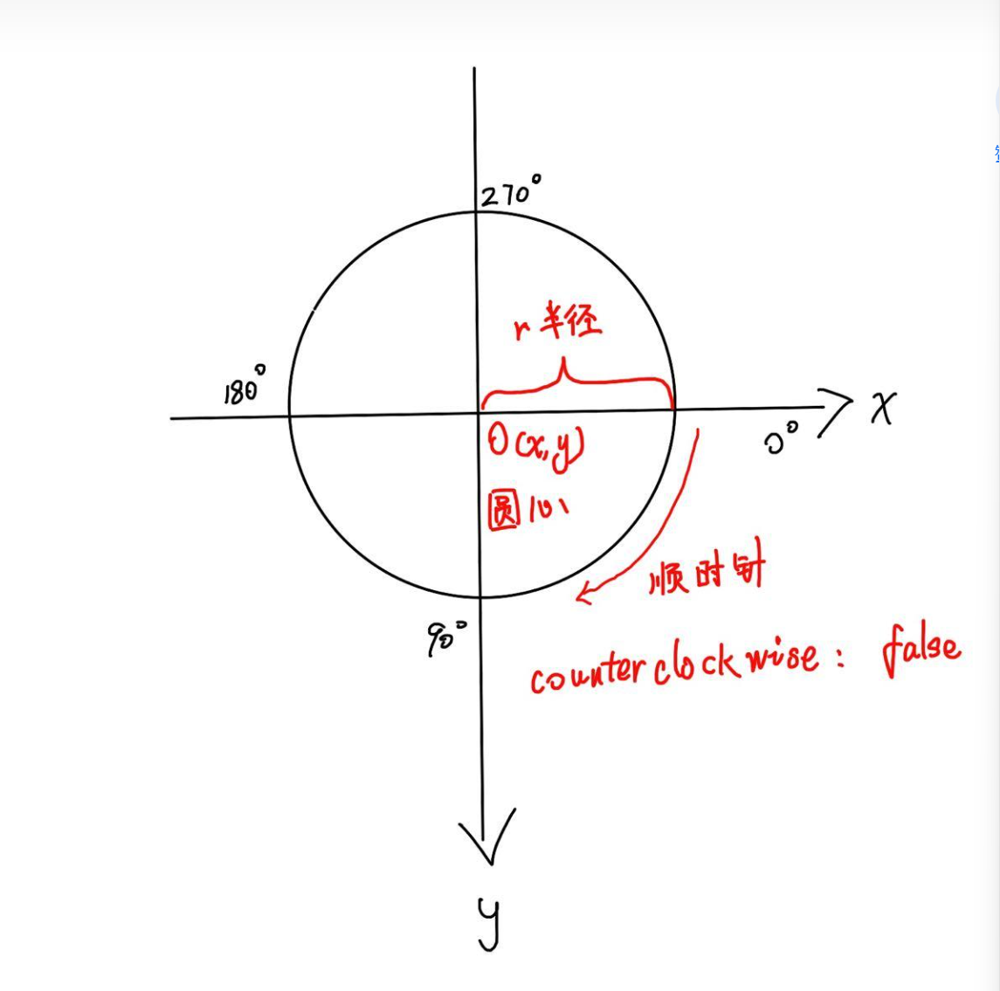
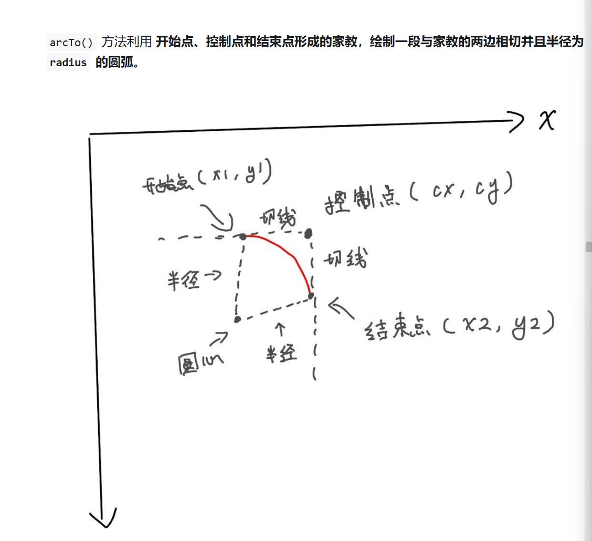
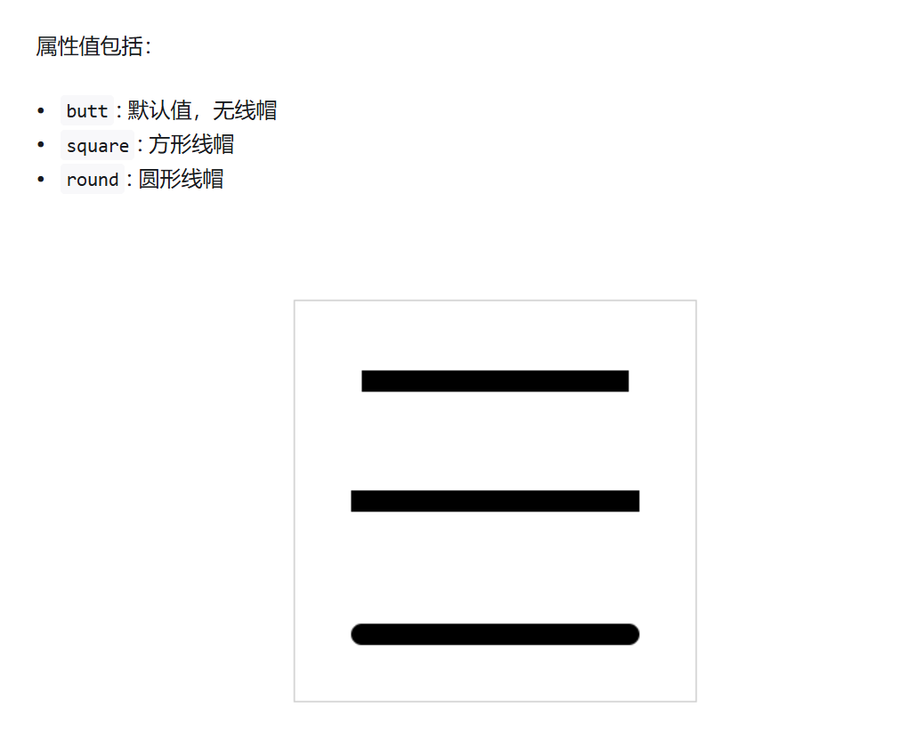
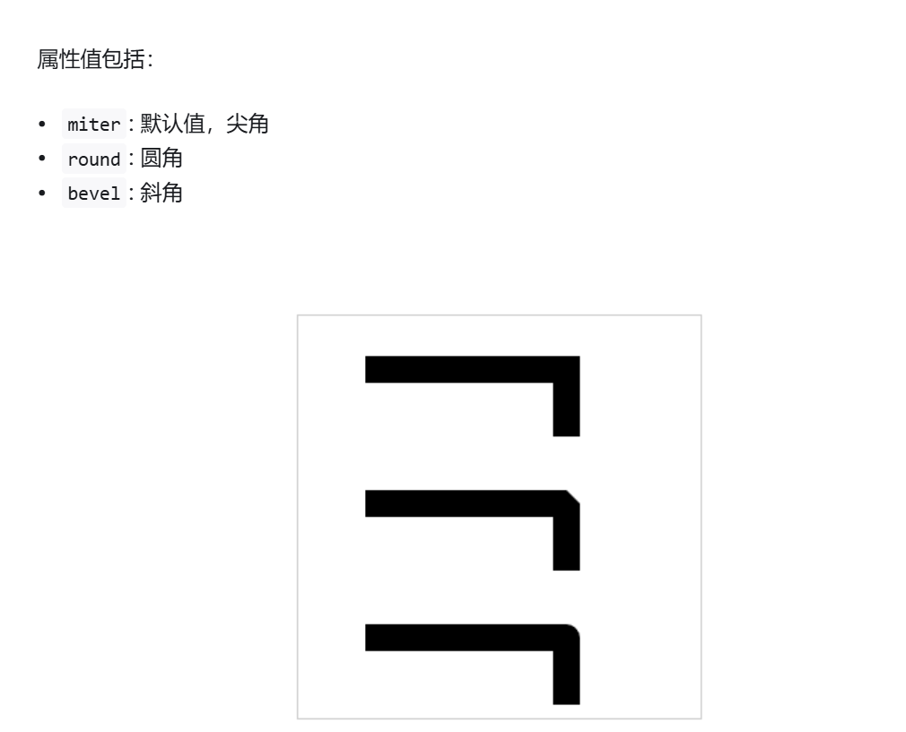
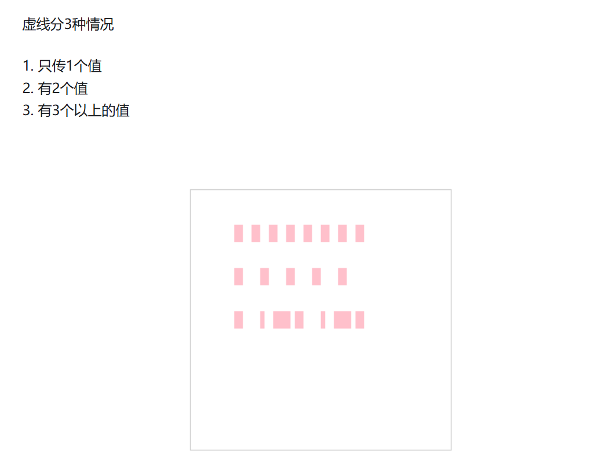
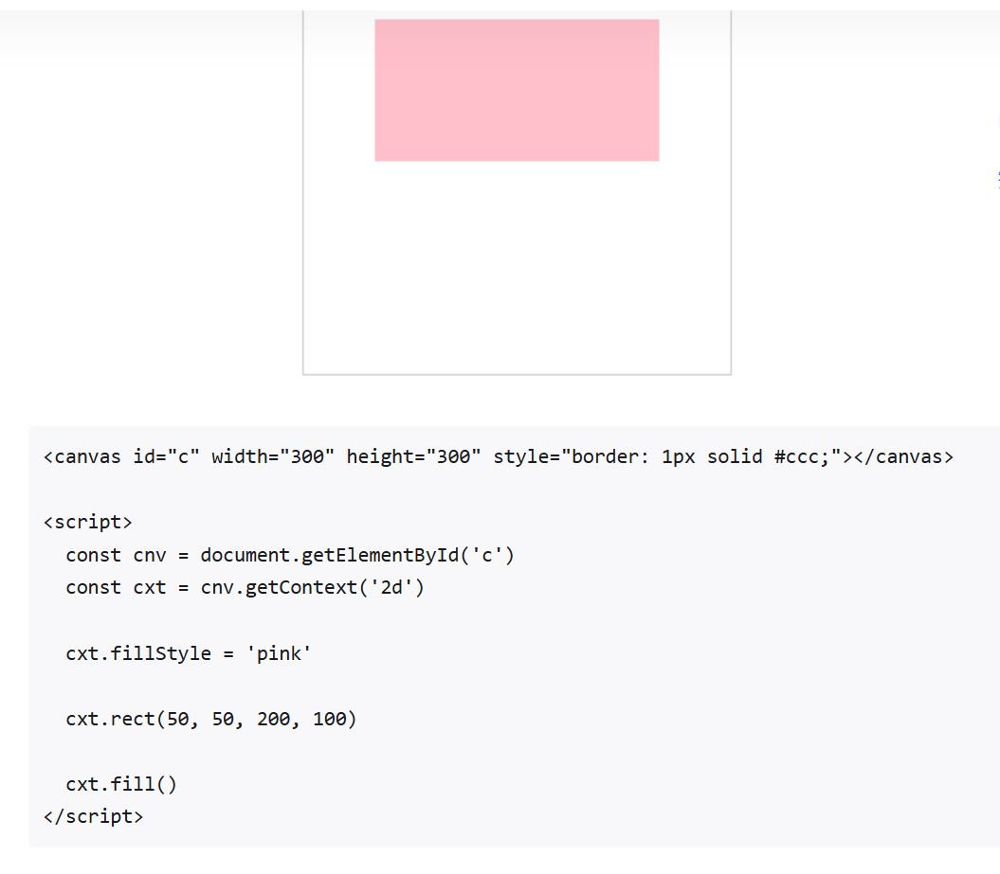
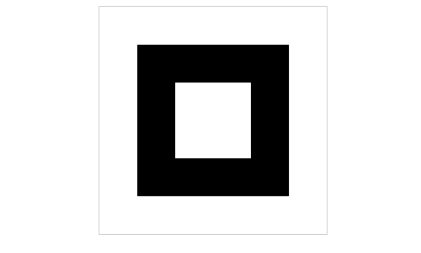
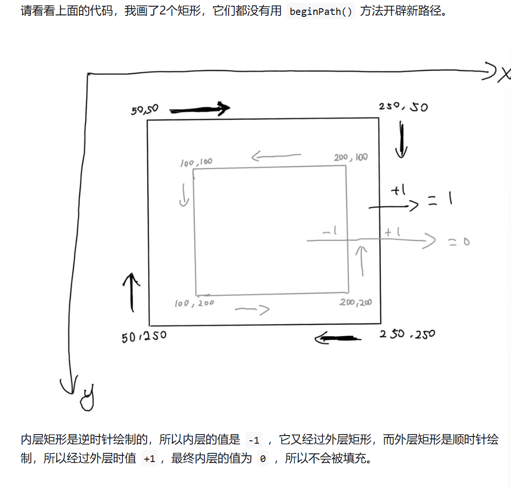
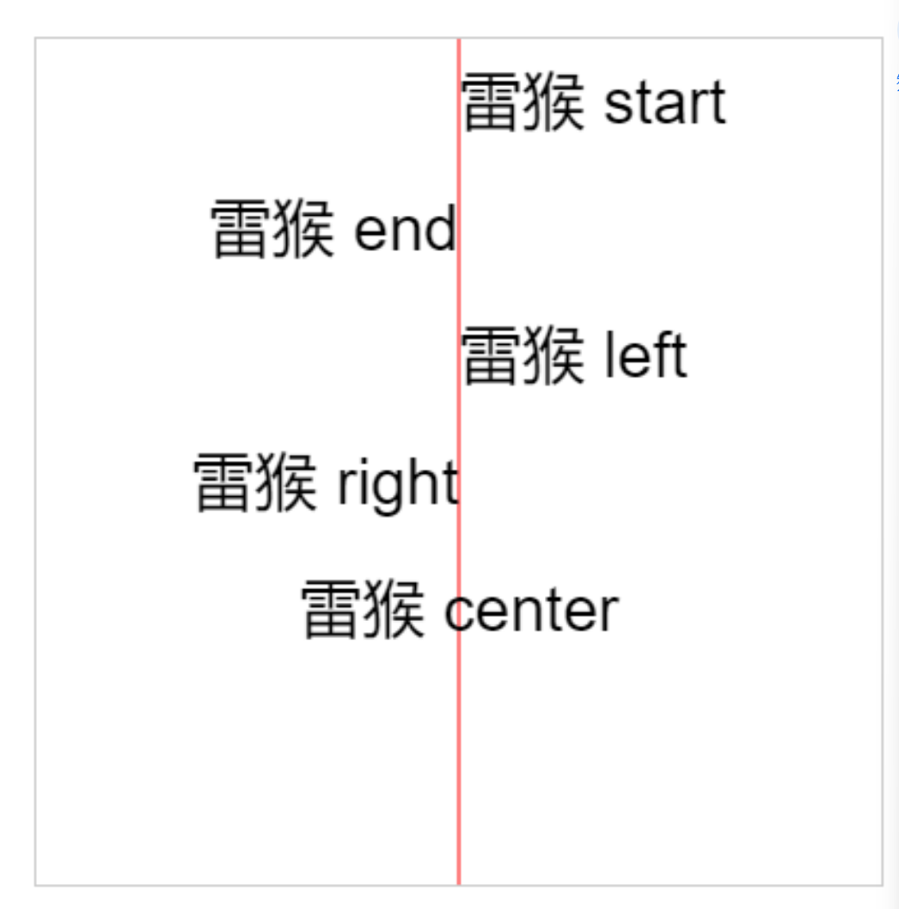

#Canvas
Canvas画布，是html5新增的一个标签
允许开发者通过JS在这个标签上绘制各种图案
拥有多种绘制路径，矩形，圆形，字符以及图片的方法
在某些情况下可以代替图片
可用于动画，游戏，数据可视化，图片编辑器，实时视频处理等领域

Canvas与Svg的区别
打开AntV旗下的图形编辑引擎做对比，G6是使用canvas开发，X6是使用svg开发的

如果要展示的数据量比较大，比如一条数据就是一个元素节点，那么canvas会比较合适
如果用户操作的交互比较多，而且对清晰度有要求（矢量图）那么使用svg会比较合适


## 画条直线


## ctx.lineTo()和 ctx.moveTo()的区别
1. ctx.moveTo(x, y)
   用途：moveTo() 用来 移动绘图的起始点，即设置路径的起点，但不会画出线段。
   功能：它只是将“画笔”移动到指定的坐标 (x, y)，但不会连接之前的位置，适用于路径的起始位置或重新定位路径的起始点。
2. ctx.lineTo(x, y)
   用途：lineTo() 用来 绘制一条从当前坐标到指定坐标 (x, y) 的直线。
   功能：它会从当前点绘制到 (x, y)，并且更新当前点的坐标到新位置。如果路径中存在多个 lineTo()，它们会连接成一条连续的直线。
   何时使用 moveTo() 和 lineTo()？
   moveTo()：用来设置路径的起始位置，或者用来在路径中间跳跃到另一个位置。比如当你想开始绘制一个新的图形或从某个特定点开始绘制时，你会使用 moveTo()。它不会绘制线条，仅仅是为了定位。

##  ctx.stroke() 将所有坐标用一条线连起来
当你用moveTo和lineTo把图形绘制好后，想要在页面中***展示出来***，就得用这个API
它会***根据当前路径的设置***（如颜色、线宽等）在***画布上绘制出路径的轮廓线***。
> ctx.lineTo和 ctx.moveTo 和ctx.stroke通常一起出现


## 默认宽高
如果不在canvas上设置宽高，那canvas元素的***默认宽度是300px***，***默认高度是150px***
> ***不能通过css设置canvas的宽高***，否则内容会出现拉伸的后果！！！！！！！！！

## 线条默认宽度和颜色
线条的默认宽度是1px,默认颜色是黑色
但由于默认情况下，canvas会将***线条的中心点和像素的底部对齐***，所以会导致显示效果是2px和非纯黑色问题

## 暂时只有IE9以上才支持canvas


## 小知识点

```html
<canvas id="c" width="300" height="300" style="border: 1px solid #ccc;"></canvas>

<script>
  const cnv = document.getElementById('c')
  const cxt = cnv.getContext('2d')

  cxt.moveTo(20, 100)
  cxt.lineTo(200, 100)
  cxt.stroke()

  cxt.moveTo(20, 120.5)
  cxt.lineTo(200, 120.5)
  cxt.stroke()
</script>
```
仔细观察一下，为什么两条线的粗细不一样的？
明明使用的方法都是一样的，只是第二条直线的 Y轴 的值是有小数点。

>答：默认情况下 canvas 会将线条的中心点和像素的底部对齐，所以会导致显示效果是 2px 和非纯黑色问题。


## ctx.lineWidth 
***设置***或***获取***绘制路径时的 线宽。

## ctx.strokeStyle
***设置***或***获取***描边的***颜色或样式***。 基本是颜色


## ctx.beginPath() 开辟新路径的方法
在绘制多条线段的同时，还要设置线段样式，通常需要开辟新路径，要不然样式之间会互相传染

## ctx.closePath() 用于关闭当前路径。它的作用是***自动连接路径的起点和终点，形成一个闭合的路径***。

## ctx.strokeRect(x,y,width,height)  strokeStyle 必须写在 strokeRect() 前面，不然样式不生效。 使用strokeRect（）后就不用再调用stroke（）方法了
x和y是矩形左上角起点；width 和 height 是矩形的宽高


## ctx.fillRect(x,y,width,height) 填充矩形，他的作用是填充矩形  方法调用后会立即绘制
说是填充，但是如果真的想填充一个矩形，那么里面的参数需要和构造矩形的参数一致才行
不然的话就相当于创建了个有填充颜色的矩形

```js
    ctx.strokeRect(10,10,100,100)

    ctx.fillRect(50, 50, 200, 100)
```

## strokeRect() 和 fillRect() 这两个方法调用后会立即绘制!!!!!

## clearRect(x,y,width,height) 清空矩形  在这个范围内的图形会全部删掉

## clearRect(0,0,canvasDom.width,canvasDom.height) 可以通过下面的代码把整个画布清空掉


## 绘制多边形 就需要moveTo（）  lineTo（） 和 closePath（） 我们推荐使用clothPath进行闭合，使用lineTo（）第一个坐标进行的闭合 在设置lineWidth后闭合处效果展示会很差


## ctx.arc（x，y，半径，开始角度，结束角度，绘制方向）
x,y是圆心坐标
true是逆时针绘制，false是顺时针，默认是false

开始角度和结束角度，都是以弧度为单位，例如180度就写Math.PI  360度就是Math.PI*2
在实际开发中 1度 是 Math.PI/180
> 在绘制圆形前，必须先调用***beginPath***（）方法，在完成后还要调用***closePath***（）
> 其实***closePath（）有的时候可以不调用***，如果你对圆形的要求是不闭环的
> 当你画圆的时候 没有调用closePath（）那么得出来的图形就是弧形
> 但是我们也有专门画弧线的API  arcTo（）画弧线

## arcTo（两切线交点的横坐标，两切线交点的纵坐标，结束点的横坐标，结束点的纵坐标，半径）画弧线
前两个参数叫控制点，紧跟其后的两个参数叫结束点

> 里面的圆心怎么确定呢？？ 用moveTo（x,y） moveTo的x,y就是圆心点


## 线条宽度 lineWidth

## 线条颜色 strokeStyle

## 线帽 lineCap= 'butt'  'square' 'round'
butt 默认值 无线帽
square 方形线帽
round 圆形线帽

> 线帽只对线条的开始和结尾处产生作用，对拐角不会产生任何作用

## 拐角样式 lineJoin
miter：默认值 尖角
round：圆角
bevel：斜角


## 虚线 setLineDash（[]）
需要传一个数组，且元素是数值型，还可以通过getLineDash（）获取虚线不重复的距离，用lineDashOffset设置虚线的偏移位


## 填充 fill（） 可以填充图形
搭配fillStyle设置填充颜色使用，默认是黑色


## 非零环绕填充

```html
<canvas id="c" width="300" height="300" style="border: 1px solid #ccc;"></canvas>

<script>
  const cnv = document.getElementById('c')
  const cxt = cnv.getContext('2d')

  // 外层矩形
  cxt.moveTo(50, 50)
  cxt.lineTo(250, 50)
  cxt.lineTo(250, 250)
  cxt.lineTo(50, 250)
  cxt.closePath()

  // 内层矩形
  cxt.moveTo(200, 100)
  cxt.lineTo(100, 100)
  cxt.lineTo(100, 200)
  cxt.lineTo(200, 200)
  cxt.closePath()
  cxt.fill()
</script>

```


##  样式font
```js
cxt.font = 'font-style font-variant font-weight font-size/line-height font-family'
```
如果需要设置字号 font-size，需要同时设置 font-family。
```js
cxt.font = '30px 宋体'
```
> 在 Canvas API 中，beginPath 的作用是开始一个新的路径，它会影响路径的绘制逻辑，但不会重置上下文的样式属性（如 lineWidth、strokeStyle 等）。因此，ctx.beginPath() 并不会影响 ctx.lineWidth 的值。

> ctx.strokeStyle="pink" 也会影响text的颜色

想在canvas中写文字
1. fillText(text, x, y, maxWidth)
2. strokeText('雷猴', 30, 90)
> 用以上两种方法都可以

## 获取文本长度 cxt.measureText(text).width
```js
 const cnv = document.getElementById('c')
  const cxt = cnv.getContext('2d')

  let text = '雷猴'
  cxt.font = 'bold 40px Arial'
  cxt.fillText(text, 40, 80)

  console.log(cxt.measureText(text).width) // 80
```

## 水平对齐方式 textAlign


## 图片
在canvas中可以使用***drawImage***方法绘制图片

1. 渲染图片
   1. 在js里加载图片在渲染
   2. 把DOM里的图片拿到canvas里渲染
渲染语法：
> drawImage(image, dx, dy)
> image: 要渲染的图片对象
> dx: 图片左上角的横坐标位置
> dy:图片左上角的纵坐标位置


2. js版
   1. 创建image对象   const image=new Image()
   2. 引入图片
   3. 等待图片加载完成
   4. 使用drawImage（）方法渲染图片
```js
 const cnv = document.getElementById('c')
  const cxt = cnv.getContext('2d')

  // 1 创建 Image 对象
  const image = new Image()

  // 2 引入图片
  image.src = './images/dog.jpg'

  // 3 等待图片加载完成
  image.onload = () => {
    // 4 使用 drawImage() 方法渲染图片
    cxt.drawImage(image, 30, 30)
  }

```

> 当创建image对象的时候 如果不需要插入到dom中可以使用new Image
> new Image 还有onload方法
> 如果需要插入到dom 可以使用document.createElement('img')

3. Dom版
```js
  const cnv = document.getElementById('c')
  const cxt = cnv.getContext('2d')
  const image = document.getElementById('dogImg')

  cxt.drawImage(image, 70, 70)

```
> 因为图片是从 DOM 里获取到的，所以一般来说，只要在 window.onload 这个生命周期内使用 drawImage 都可以正常渲染图片。

4. 设置图片宽高 方法一样多两个参数
> drawImage(image, dx, dy, dw, dh)


5. 截取图片
> drawImage(image, sx, sy, sw, sh, dx, dy, dw, dh)
以上参数缺一不可
image: 图片对象
sx: 开始截取的横坐标
sy: 开始截取的纵坐标
sw: 截取的宽度
sh: 截取的高度
dx: 图片左上角的横坐标位置
dy: 图片左上角的纵坐标位置
dw: 图片宽度
dh: 图片高度