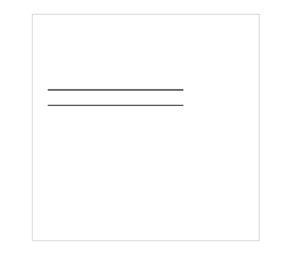
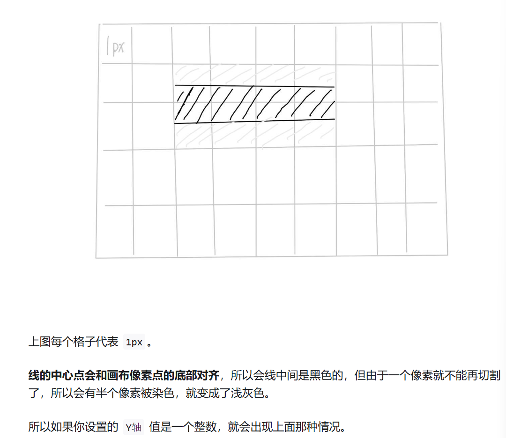
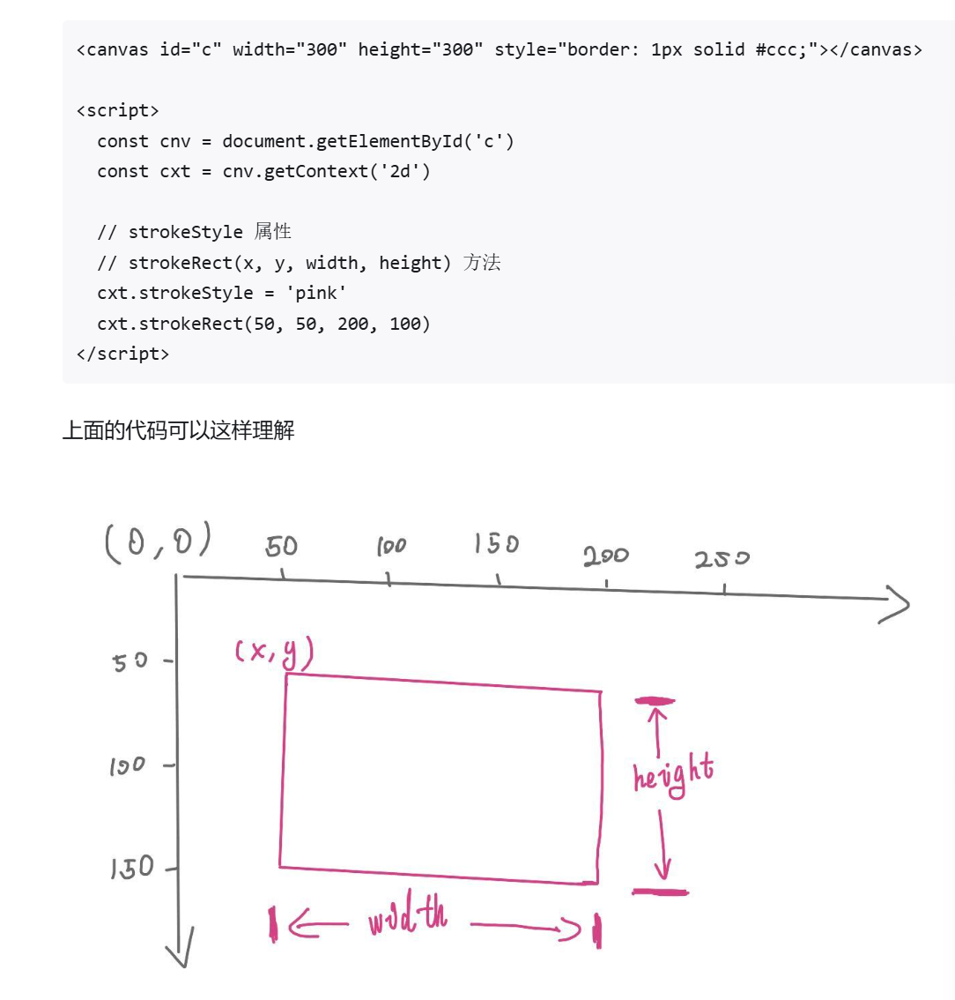
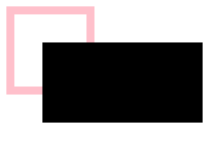

#Canvas
Canvas画布，是html5新增的一个标签
允许开发者通过JS在这个标签上绘制各种图案
拥有多种绘制路径，矩形，圆形，字符以及图片的方法
在某些情况下可以代替图片
可用于动画，游戏，数据可视化，图片编辑器，实时视频处理等领域

Canvas与Svg的区别
打开AntV旗下的图形编辑引擎做对比，G6是使用canvas开发，X6是使用svg开发的

如果要展示的数据量比较大，比如一条数据就是一个元素节点，那么canvas会比较合适
如果用户操作的交互比较多，而且对清晰度有要求（矢量图）那么使用svg会比较合适


## 画条直线


## ctx.lineTo()和 ctx.moveTo()的区别
1. ctx.moveTo(x, y)
   用途：moveTo() 用来 移动绘图的起始点，即设置路径的起点，但不会画出线段。
   功能：它只是将“画笔”移动到指定的坐标 (x, y)，但不会连接之前的位置，适用于路径的起始位置或重新定位路径的起始点。
2. ctx.lineTo(x, y)
   用途：lineTo() 用来 绘制一条从当前坐标到指定坐标 (x, y) 的直线。
   功能：它会从当前点绘制到 (x, y)，并且更新当前点的坐标到新位置。如果路径中存在多个 lineTo()，它们会连接成一条连续的直线。
   何时使用 moveTo() 和 lineTo()？
   moveTo()：用来设置路径的起始位置，或者用来在路径中间跳跃到另一个位置。比如当你想开始绘制一个新的图形或从某个特定点开始绘制时，你会使用 moveTo()。它不会绘制线条，仅仅是为了定位。

##  ctx.stroke() 将所有坐标用一条线连起来
当你用moveTo和lineTo把图形绘制好后，想要在页面中***展示出来***，就得用这个API
它会***根据当前路径的设置***（如颜色、线宽等）在***画布上绘制出路径的轮廓线***。
> ctx.lineTo和 ctx.moveTo 和ctx.stroke通常一起出现


## 默认宽高
如果不在canvas上设置宽高，那canvas元素的***默认宽度是300px***，***默认高度是150px***
> ***不能通过css设置canvas的宽高***，否则内容会出现拉伸的后果！！！！！！！！！

## 线条默认宽度和颜色
线条的默认宽度是1px,默认颜色是黑色
但由于默认情况下，canvas会将***线条的中心点和像素的底部对齐***，所以会导致显示效果是2px和非纯黑色问题

## 暂时只有IE9以上才支持canvas


## 小知识点

```html
<canvas id="c" width="300" height="300" style="border: 1px solid #ccc;"></canvas>

<script>
  const cnv = document.getElementById('c')
  const cxt = cnv.getContext('2d')

  cxt.moveTo(20, 100)
  cxt.lineTo(200, 100)
  cxt.stroke()

  cxt.moveTo(20, 120.5)
  cxt.lineTo(200, 120.5)
  cxt.stroke()
</script>
```
仔细观察一下，为什么两条线的粗细不一样的？
明明使用的方法都是一样的，只是第二条直线的 Y轴 的值是有小数点。

>答：默认情况下 canvas 会将线条的中心点和像素的底部对齐，所以会导致显示效果是 2px 和非纯黑色问题。



## ctx.lineWidth 
***设置***或***获取***绘制路径时的 线宽。

## ctx.strokeStyle
***设置***或***获取***描边的***颜色或样式***。 基本是颜色


## ctx.beginPath() 开辟新路径的方法
在绘制多条线段的同时，还要设置线段样式，通常需要开辟新路径，要不然样式之间会互相传染

## ctx.closePath() 用于关闭当前路径。它的作用是***自动连接路径的起点和终点，形成一个闭合的路径***。

## ctx.strokeRect(x,y,width,height)  strokeStyle 必须写在 strokeRect() 前面，不然样式不生效。 使用strokeRect（）后就不用再调用stroke（）方法了
x和y是矩形左上角起点；width 和 height 是矩形的宽高


## ctx.fillRect(x,y,width,height) 填充矩形，他的作用是填充矩形
说是填充，但是如果真的想填充一个矩形，那么里面的参数需要和构造矩形的参数一致才行
不然的话就相当于创建了个有填充颜色的矩形

```js
    ctx.strokeRect(10,10,100,100)

    ctx.fillRect(50, 50, 200, 100)
```