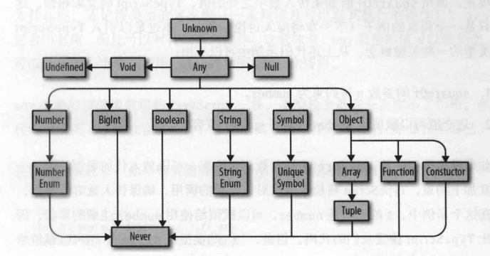
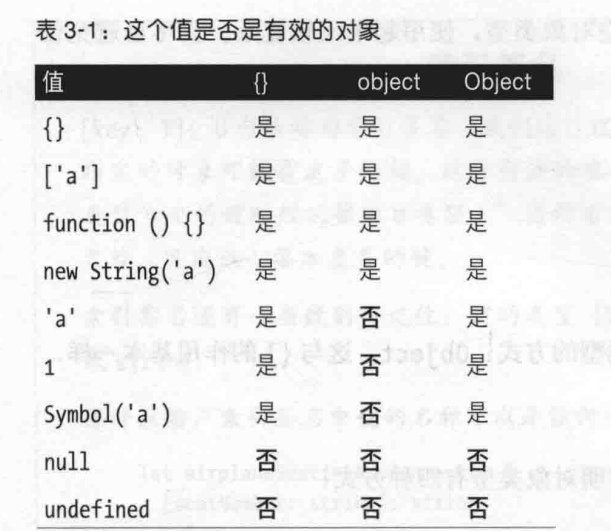
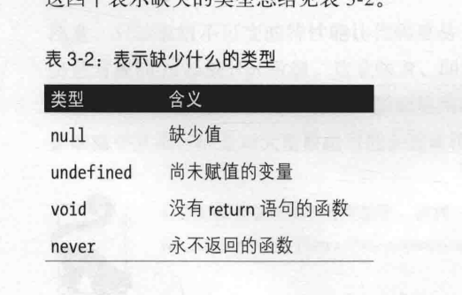
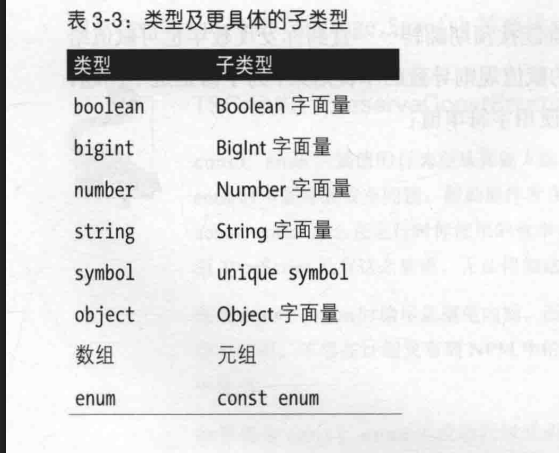
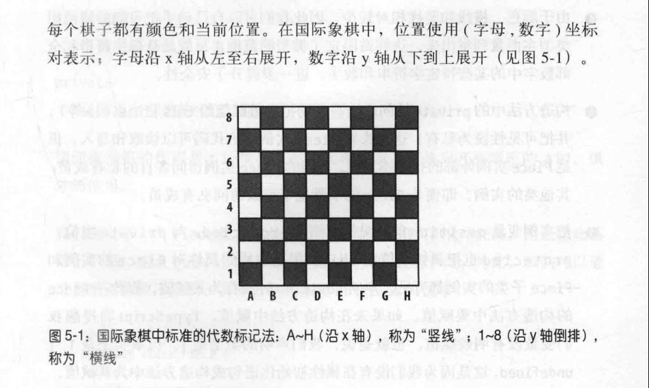

# TypeScript编程

练习链接
> https://github.com/bcherny/programming-typescript-answers

you don't know js 这本书看下

## 第一章 引言

### 类型安全

借助类型避免程序做无效的事情】

## 第二章 TS概述

接受ts语言，概述ts编译器tsc的工作原理，开发中能用到的ts特性和模式

### 编译器

程序是由一些文件构成，文件是程序员编写的文本，这些文本由一个特殊的程序（称为编译器）解析，
转换成抽象语法树（AST）。AST是去掉了空白，注释和缩进用的制表符或空格之后的数据结构
编译器把AST转换成一种称为字节码的底层表示，字节码再传给运行时程序的计算，得到最终结果
也就是说，运行程序就是让运行时计算由编译器从源码解析得来的AST生成的字节码

> 步骤
> 1. 程序解析为AST
> 2. AST编译为字节码
> 3. 运行时计算字节码

但是TS比较特殊
他不直接编译成字节码，而是编译成js代码，然后在解析AST然后编译为字节码

TS编译器生成AST后，真正运行代码之前，TS会对代码做***类型检查***

### 类型检查器

检查代码是否符合类型安全要求的特殊程序
类型检查时TS的魔力所在，有了这一步，TS才能保证程序能按预期正常运行，没有显而易见的错误

TS的编译过程

1. TS源码->TS AST
2. 类型检查器检查AST
3. TS AST-> JS源码

4. JS源码-> JS AST
5. JS AST-> 字节码
6. 运行时计算字节码

在这个过程中，第1-2步使用程序的类型，第三步不适用
> 注意 TSC把ts编译成js时，不会考虑类型 类型只会在类型检查这一步使用

### 类型系统

类型检查器为程序分配类型时使用的一系列规则
一般来说，类型系统有两种，一种通过显式语法告诉编译器所有值的类型（java）
另一种自动推导值的类型（js）。这两种类型系统各有利弊

TS身兼两种类型系统，可以显式注解类型，也可以让TS推导多数类型

一般来说，最好让TS推导类型，少数情况下才显式注解类型

JS动态绑定类型，因此必须运行程序才能知道类型，在运行程序之前，JS对类型一无所知

### 准备环境

> npm install typescript tslint @types/node
> npx tsc --init

> npx tsc .\index.ts 这样可以把一个ts编译为js

## 第三章 类型全解

### 类型

类型层次结构


#### any

any是类型的教父。为达目的，他不惜一切代价，但是不要轻易请他出面，除非迫不得已
在ts中，编译时一切一切都要有类型，如果你和ts无法确定类型是什么，默认是any
这是兜底类型，应该尽量避免使用

#### unknown

如果any是教父，那么unknown就是与坏人同流合污，但是内心却尊重法律，站在好人这一边
少数情况下，如果你确实无法预知一个值的类型，不要使用any，应该使用unknown
与any类似，unknown也表示任何值，但是ts会要求你再做检查，细化类型

unknown 支持 == === || && ? 可以否定 可以使用typeof instanceof运算符

1. ts不会把任何值推导为unknown，必须显式注解
2. unknown类型的值可以比较
3. 执行操作时，不能假定unknown类型的值为某种特定类型，必须向ts证明一个值确实是某个类型

```ts
let aa: unknown = 10
let bb = 20
let cc = aa + bb //会报错 aa is of type unknown
if (typeof aa === 'number') {
    let dd = aa + bb  //不报错
}
```

#### boolean

很简单

#### 类型字面量

仅表示一个值的类型

```ts
let e: true = true
```

#### number

```ts
let f: 26.218 = 26.218
let c: number = 5.12
```

#### bigint

bigint 是js与ts新引入的类型，在处理较大的整数时，不用再担心舍入误差

```ts
let f: bigint = 100n //要这么使用
let d: bigint = 100 //这个会报错
```

#### string

简单

#### symbol

在js中Symbol('a')使用指定的名称新建一个符号，这个符号是唯一的，不与其他任何符号相等（使用==或===比较）
即便再使用相同的名称创建一个符号也是如此

```ts
let a: symbol = Symbol('a')
```

#### 对象

这个就有点东西了

```ts
let a: object = {
    b: "123"
}
console.log(a.b) //TS2339: Property b does not exist on type object
```

其实object仅比any的范围窄些，但也窄不了多少。object对值知之甚少，只能表示该值是一个js对象（而且不是null）
{} 除 null 与undefined 之外的任何类型都可以赋值给空对象类型，尽量避免使用这个
另外还有就是Object 这个O是大写的,他与{}的作用基本一样，最好也避免使用


#### 类型别名

```ts
type Age = number  //但是同一个类型 不能声明两次
type Person = {
    name: string;
    age: Age
}
```

类型别名也有块级作用域 ！ 这个之前不知道

```ts
type color = 'red'
let x = Math.random() < .5
if (x) {
    type color = 'blue'
    let b: color = 'blue'
} else {
    let b: color = 'red'
}
```

#### 交集&并集

并集使用| 交集使用& 通常我们用并集用的多
A | B（并集）：可以是 A 或者 B（或者同时满足 A 和 B，但不是必须）。
A & B（交集）：必须同时是 A 和 B（不能只满足其中一个）。
满足指的是实现type里的所有属性

```ts
type cat = {
    name: string
    purrs: boolean
}

type dog = {
    name: string
    barks: boolean
    wags: boolean
}
type catOrDogOrBoth = cat | dog   //至少满足 Cat 或 Dog 的属性集 或都满足
type catAndDog = cat & dog // 必须满足 Cat 和 Dog 的所有属性


```

#### 数组

与对象一样，使用const声明的数组不会导致ts推导出范围更窄的类型
有个特殊的情况,如果刚开始数组为空还没有定义数组类型,这是个极特殊的情况

```ts
function buildArray() {
    let a = [] // any[]
    a.push(1)   // number[]
    a.push("a") // (string | number)[]
    return a
}

let arr3 = buildArray()  //(string | number)[]
arr3.push(true) // 所以会报错
```

#### 元组

元组是array的子类型，是定义数组的一种特殊方式，长度固定，各索引位置上的值具有固定的已知类型
与其他多数类型不同，声明元组必须显式注解类型

```ts
const cc: [number] = [1]
const dd: [string, string, number] = ['go', 'zp', 20]
const ee: [string, number?] = ["123"]

const ff: [string, number, ...boolean[]] = ["gg", 123, false, true]  //还支持剩余元素，方便拓展

```

#### null、undefined、void、never



### 枚举

这个地方有模糊点，开发中不推荐使用

```ts
enum gg {
    English = 0,
    Chinese = 1
}
```

#### 第三章小结



## 第四章 函数

### 声明和调用函数

#### 剩余参数

```ts
const demoHandler = (...num: number[]) => {
    console.log("num", num) // [1,5,5,9,10]
}
demoHandler(1, 5, 5, 9, 10)

```

#### 生成器函数

```ts
function* createFibonacci() {
    let a = 0
    let b = 1

    while (true) {
        yield a;
        [a, b] = [b, a + b];
    }
}

const gen = createFibonacci() //这一步是最关键的，一定要这么用
console.log(gen.next().value)
console.log(gen.next().value)
```

#### 迭代器

迭代器是生成器的相对面，生成器是生成一系列值的方式，而迭代器是使用这些值得方式

可迭代对象：
有Symbol.iterator属性的对象，而且该属性的值是一个函数，函数返回一个迭代器

迭代器：
定义有next方法的对象，该方法返回一个具有value和done属性的对象

创建生成器，得到的值既是可迭代对象，也是迭代器，因为该值既有Symbol.iterator属性 也有next方法

我们可以手动定义一个迭代器或者可迭代对象

```ts
let number = {
    * [Symbol.iterator]() {
        for (let i = 0; i < 10; i++) {
            yield i
        }
    }
}
//number是一个迭代器，调用生成函数number[Symbol.iterator]() 返回一个可迭代的迭代器
```

除了可以自己定义外，还可以使用js内置的常用集合类型（Array Map Set String等）迭代器 注意（Object，Number）不是迭代器
可以用for of迭代一个迭代器

```ts
let number = {
    * [Symbol.iterator]() {
        for (let i = 0; i < 10; i++) {
            yield i
        }

    }
}
//number是一个迭代器，调用生成函数number[Symbol.iterator]() 返回一个可迭代的迭代器
//使用for of迭代一个迭代器
for (const numberElement of number) {
    console.log(numberElement) // 0 1 2 3 4 5 6 7 8 9
}

//展开一个迭代器
const allElements = [...number]

//析构一个迭代器
const [one, two, ...rest] = number
```

#### 调用签名

调用签名必须显性注解

```ts
//在ts中可以这样表示该函数的类型,这是ts表示函数类型的句法，也成调用签名（类型签名），注意调用签名的语法和箭头函数语法很相似，这是有意为之的
type myfunc = (a: string, b: number) => number
```

#### 函数类型重载(学得不好)

```ts
//注意 这里是 【type】
type myFunc = (a: number, b: string) => void //这是简写型调用函数

type myFunc2 = {
    (a: string, b: number): void  //这是完整型调用函数
}
```

这两种写法完全等效，只是使用的句法不同
简单情况下我们首选简写型，但是较为复杂的函数，使用完整签名有着更多的好处
首先是重载函数类型的情况

#### 泛型参数 之后的内容也没好好看下去

```ts
type filter = {
    <T>(a: T): T
}
const filter: filter = (a) => {
    return a
}
filter(1)
filter("123")
```

之后的内容

## 第五章 类和接口 第五章需要彻底重新学习

### 类和继承（要再次看看书）



### 接口

## 第六章 类型进阶 细看

### 对象类型进阶

#### 键入运算法 用在类型上

任何结构（对象，类构造方法，或类的实例）和数组都可以键入，例如单个好友生命

```ts
type APIResponse = {
    user: {
        userId: string,
        friendList: {
            count: number,
            friends: {
                firstName: string,
                lastName: string,
            }
        }[]
    }
}
//我们使用键入
type FriendListNew = APIResponse['user']['friendList']
//这样就不用做下面的操作了
type FriendList = {
    count: number,
    friends: {
        firstName: string,
        lastName: string,
    }
}[]
```

任何结构（对象，类构造方法，或类的实例）和数组都可以键入，例如单个好友声明

```ts
type SingleFriend = APIResponse['user']['friendList']['friends'][number] //number是【键入】数组类型的方式，若是元组可以使用0 1或其他数字字面量类型表示想【键入】的索引
```


#### keyof运算符 用在类型上
获取对象所有键的类型,其实就是获取所有的key
```ts
type ResponseKeys=keyof APIResponse  // 结果是 'user'
const a :ResponseKeys='user'

type User ={
    name:string,
    age:number,
    sex:boolean
}
type U=keyof User  //  "name" | "age" | "sex"
```


#### Record类型
内置的Record类型用于描述有关映射关系的对象
```ts
type Weekday='Mon' | 'Tue' | 'Wed' | 'Thu' | 'Fri'
type Day=Weekday | 'Sat' | 'Sun'
const nextDay:Record<Weekday, Day>={
    Mon:"Thu"
}
```


#### 映射类型  {[key in Weekday] : Day} 面对的其实也是类型
一个对象最多有一个映射类型   in 后面 必须是 1 | 2 | 3 | 4 这样的， 我们可以通过keyof来创造有的时候
```ts
const nextDayNew:{[key in Weekday]:Day}={
    Tue:"Mon"
}
```
内置的映射类型
Record<keys,values> 键的类型是keys，值的类型为values的对象
Partial<Object> 把Object中的每个字段都标记为可选
Required<Object> 把Object中的每个字段都标记为必须得
Readonly<Object> 标记为只读
Pick<Object,key> 返回Object的子类型，只含指定的keys


### 函数类型进阶（需要再次静下心学）

#### infer关键字

#### 内置的条件类型
Exclude<T,U> 计算在T 不在U中的类型
```ts
type A= number | string
type B=string
type C =Exclude<A, B>  //number
```

Extract<T,U> 计算T中可赋值给U的类型 就是提取出共同点
```ts
type A= number | string
type B=string
type C =Extract<A, B>  //string
```

NonNullable<T> 从T中排除null和undefined
```ts
type D ={a?:string | null}
type F =NonNullable<D['a']> // string
```

#### 类型断言
```ts
//这两个表达的意思是一个
formatInput(input as string)
formatInput(<string>input) //这个是旧语法
```

#### 非空断言
!.


## 第七章 处理错误
本章讨论typescript为表示和处理错误而提供的一些最为常用的模式
1. 返回null
2. 抛出异常
3. 返回异常
4. Option类型

### 返回null

### 抛出异常


## 第八章 异步编程、并发和并行

### 事件循环

### 手动实现Promise


## 拓展：TS中的infer
infer通过用于条件类型中，它允许我们在类型操作中进行类型推断，简单来说，就是***能够从已有的类型中提取出一部分类型信息***
infer关键字只能在条件类型中使用，通常与泛型和extends关键字一起使用，他的语法如下
```ts
type First<T> = T extends infer U ? U : never; //这个语句其实是没有意义的
```
