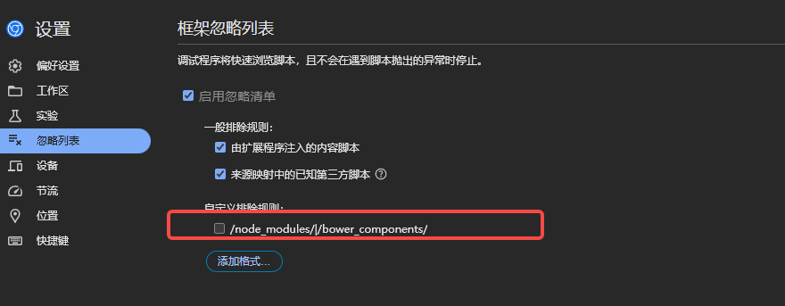

# 开发经验教训
1. after伪元素使用
   伪元素 ::after 只能作用于元素的内容，而 img 标签是一个自闭合标签，不能包含内容。因此，::after 伪元素无法应用在 img 上。
2. 经度 0度是本初子午线 范围是-180度到180度
3. 维度 0度是赤道 范围是-90度到90度
4. 弧度 弧度是一种角度的度量单位，一个完整的圆周被定义为2π弧度
   1弧度=180度/π 度 ≈57.2958度
   使用弧度的地理坐标可以简化一些数学运算，尤其是涉及到三角函数和地球曲率的计算
   例如，两点之间的大圆距离（地球表面的最短路径）使用弧度可以更直接的应用球面三角学公式
   地理坐标（弧度）的应用
   1. 距离计算：使用球面三角学公式，可以更准确的计算出两点之间的距离
   2. 方向计算：确定一个点到另一个点的方向
   3. 地球投影：在某些地图投影中，使用弧度可以更自然的处理地球表面的曲率
5. 屏幕坐标系，以左上角为0,0点，越向右 x越大，越向下y越大
   屏幕坐标系在cesium中叫做二维笛卡尔平面坐标,单位通常使用像素（px）作为单位
   ```js
   new Cesium.Cartesian2(x, y)
   ```
6. 空间直角坐标系
   空间直角坐标系是一种三维坐标系统，用于在三维空间中精确的表示，点线面的位置
   这种坐标系通常由三个正交的坐标轴组成：X,Y和Z轴
7. 3D笛卡尔坐标系

   坐标系的原点位于地球的中心，因此这些坐标系通常是负的，单位通常是***米***
8. 地理坐标系：是一种基于经度和纬度的坐标系，它使用度数来表示位置
   在Cesium中 地理坐标可以通过将经度，纬度，高度值传递给Cartographic对象来表示
   Cesium将地理坐标转换成笛卡尔坐标以在地球表面进行可视化，笛卡尔坐标系的单位是m  也就是把经纬度和高度转为了 笛卡尔坐标系下的m
9. 坐标系转换
   1. 经纬度转空间直角
   ```js
   const cartesian3 = Cesium.Cartesian3.fromDegrees(lng, lat, height);
   ```
   2. 经纬度转地理坐标（弧度）
   ```js
   const radians = Cesium.Math.toRadians(degrees)
   ```
   3. 有很多 https://juejin.cn/post/7404091675666055209?searchId=2024111216040182429EFF6C0EBB1A2A68

10. 如果png有特效的话，且不是循环特效，就必须使用img标签来展示图片，使用background-img来做操作的话，那些特效只会展示一次（自己踩过坑）
11. :active 只有在鼠标点击摁住不放的时候才会完整触发，如果只是很快的点击，那么效果不是很明显
12. scaleX(-1)是左右镜像反转  Y是上下镜像反转
13. 在 CSS 中，媒体查询的优先级是由 最后匹配的规则 来决定的。因此，尽管 1000px 同时满足这两个媒体查询的条件，但是***后定义的规则会覆盖前面的规则***。
   ```css
    @media  (min-width: 480px) and (max-width: 1000px) {
      body{
       font-size: 18px;
      }
      }
      @media  (min-width: 1000px) {
      body{
       font-size: 22px;
      }
   ```

14. transition组件 ***Vue自带的***
   ```html
   <transition name="fade" mode="out-in">
     
       :src="activeFunc === '智慧交通' ? backgroundOn : backgroundOff"
       alt="decorate"
     >
   </transition>
   ```
   ```css
   /* 定义进入和离开时的过渡效果 */
   .fade-enter-active, .fade-leave-active {
     transition: opacity 0.5s ease;
   }
   
   .fade-enter, .fade-leave-to {
     opacity: 0;
   }
   ```
   元素的插入和移除的触发场景有以下几种：
   v-if/v-else/v-else-if触发的切换。
   v-show触发的切换。
   component动态组件触发的切换。
   改变特殊的key属性。


   // 进入动画的类名
   .fade-enter-from
   .fade-enter-active
   .fade-enter-to
   
   // 离开动画的类名
   .fade-leave-from
   .fade-leave-active
   .fade-leave-to

   自定义动画class 通常结合animation.css使用
   ```html
   <Transition
     name="custom-classes"
     enter-active-class="animate__animated animate__tada"
     leave-active-class="animate__animated animate__bounceOutRight"
   >
     。。。
   </Transition>

   ```
15. 如果想要在代码中可以打debugger进行调试，需要进行着设置，取消node_modules的勾选

16. drop-shadow() 过滤器则是创建一个符合图像本身形状(alpha 通道)的阴影。
用于围绕背景色是透明色的图片，按照里面图片内容的形状做阴影效果
    filter: drop-shadow(offset-x offset-y blur-radius color);
17. box-shadow: inset 0 10px 8px -8px rgba(0, 0, 0, 0.3); /* 顶部内部阴影 */
    关键点解析
    inset: 表示阴影是内部的。
    0: 水平偏移量，0 表示阴影居中。
    10px: 垂直偏移量，正值表示阴影从顶部向下扩展。
    8px: 模糊半径，控制阴影的模糊程度。
    -8px: 扩散半径，负值表示让阴影在其他区域迅速消失，仅保留顶部阴影。
    rgba(0, 0, 0, 0.3): 阴影颜色，带透明度。
18. webpack中在js中引入图片路径需要require，不然的话他们不会解析@/  ，如果是vite的话就不用require
```js
 images: [
         require('@/assets/images/lotusPod/pod/pod1.png'),
         require('@/assets/images/lotusPod/pod/pod2.png'),
         require('@/assets/images/lotusPod/pod/pod3.png'),
         require('@/assets/images/lotusPod/pod/pod4.png'),
         require('@/assets/images/lotusPod/pod/pod5.png'),
         require('@/assets/images/lotusPod/pod/pod6.png'),
         require('@/assets/images/lotusPod/pod/pod7.png'),
         ],
```
19. parseInt(window.getComputedStyle(this.$refs['slideShowRef']).left, 10) || 0)
        这是因为 `Number()` 和 `parseInt()` 的工作方式不同：
    
    ---
    
    ### **1. `Number()` 的行为**
    - `Number()` 只能将完全由数字组成的字符串转换为数字。如果字符串中包含非数字字符（如 `"12px"` 中的 `"px"`），`Number()` 会直接返回 `NaN`。
      - 它要求整个字符串是一个有效的数字格式，例如：
        ```javascript
        Number("12");       // 12
        Number("12.34");    // 12.34
        Number("12px");     // NaN，因为包含非数字字符
        ```
    
    ---
    
    ### **2. `parseInt()` 的行为**
    - `parseInt()` 是为了解析字符串中的整数设计的。
      - 它会从字符串的**左侧开始解析**，直到遇到第一个无法解析为数字的字符，然后停止解析。
      - 即使字符串中有非数字字符，只要它们不在数字的开头，`parseInt()` 也能返回解析出的整数值：
        ```javascript
        parseInt("12px", 10);    // 12，忽略后面的 "px"
        parseInt("12.34px", 10); // 12，只取整数部分
        parseInt("abc12", 10);   // NaN，因为从开头就无法解析为数字
        ```
    
    ---
    
    ### **3. 总结对比**
    
    | 方法          | 适用场景                              | 示例输入       | 返回值    | 说明                                      |
    |---------------|---------------------------------------|---------------|-----------|-------------------------------------------|
    | `Number()`    | 解析**整个字符串**是否为有效数字        | `"12px"`      | `NaN`     | 整个字符串包含非数字字符，解析失败        |
    | `parseInt()`  | 从左到右解析，遇到非数字字符时停止解析 | `"12px"`      | `12`      | 忽略后面的 `"px"`，只解析到数字部分       |
    
    ---
    
    ### **4. 应用场景选择**
    - 如果你只需要提取字符串中数字部分（如处理像素值），使用 `parseInt()` 是更好的选择。
      - 如果你需要严格验证整个字符串是否是数字，使用 `Number()` 更合适。
    
    ---
    
    ### **5. 补充建议**
    - 如果解析的是 CSS 样式值（如 `"12px"`），一般使用 `parseInt()` 或 `parseFloat()` 处理：
      ```javascript
      const value = "12px";
      console.log(parseInt(value, 10));  // 12
      console.log(parseFloat(value));   // 12，如果有小数部分会保留
      ```
