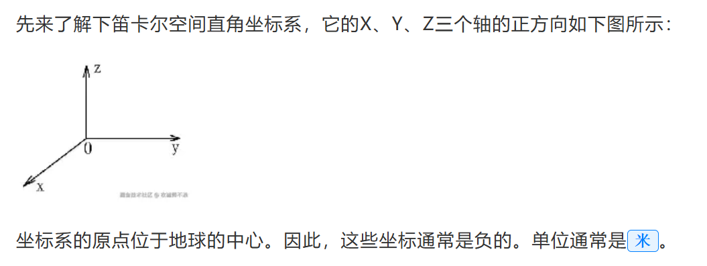

# 开发经验教训
1. after伪元素使用
   伪元素 ::after 只能作用于元素的内容，而 img 标签是一个自闭合标签，不能包含内容。因此，::after 伪元素无法应用在 img 上。
2. 经度 0度是本初子午线 范围是-180度到180度
3. 维度 0度是赤道 范围是-90度到90度
4. 弧度 弧度是一种角度的度量单位，一个完整的圆周被定义为2π弧度
   1弧度=180度/π 度 ≈57.2958度
   使用弧度的地理坐标可以简化一些数学运算，尤其是涉及到三角函数和地球曲率的计算
   例如，两点之间的大圆距离（地球表面的最短路径）使用弧度可以更直接的应用球面三角学公式
   地理坐标（弧度）的应用
   1. 距离计算：使用球面三角学公式，可以更准确的计算出两点之间的距离
   2. 方向计算：确定一个点到另一个点的方向
   3. 地球投影：在某些地图投影中，使用弧度可以更自然的处理地球表面的曲率
5. 屏幕坐标系，以左上角为0,0点，越向右 x越大，越向下y越大
   屏幕坐标系在cesium中叫做二维笛卡尔平面坐标,单位通常使用像素（px）作为单位
   ```js
   new Cesium.Cartesian2(x, y)
   ```
6. 空间直角坐标系
   空间直角坐标系是一种三维坐标系统，用于在三维空间中精确的表示，点线面的位置
   这种坐标系通常由三个正交的坐标轴组成：X,Y和Z轴
7. 3D笛卡尔坐标系

   坐标系的原点位于地球的中心，因此这些坐标系通常是负的，单位通常是***米***
8. 地理坐标系：是一种基于经度和纬度的坐标系，它使用度数来表示位置
   在Cesium中 地理坐标可以通过将经度，纬度，高度值传递给Cartographic对象来表示
   Cesium将地理坐标转换成笛卡尔坐标以在地球表面进行可视化，笛卡尔坐标系的单位是m  也就是把经纬度和高度转为了 笛卡尔坐标系下的m
9. 坐标系转换
   1. 经纬度转空间直角
   ```js
   const cartesian3 = Cesium.Cartesian3.fromDegrees(lng, lat, height);
   ```
   2. 经纬度转地理坐标（弧度）
   ```js
   const radians = Cesium.Math.toRadians(degrees)
   ```
   3. 有很多 https://juejin.cn/post/7404091675666055209?searchId=2024111216040182429EFF6C0EBB1A2A68