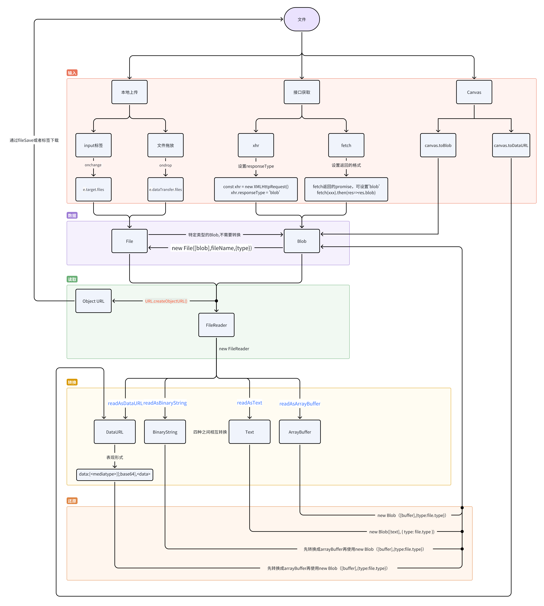

# 前端速通Blob、File、FileReader、ArrayBuffer、Base64、URL.createObjectURL()  链接：https://juejin.cn/post/7424414729857400870

https://juejin.cn/post/7395866692798201871?share_token=030ac1da-7aee-4d02-8fbb-c29090b8ffbe
## Blob

Blob 对象表示一个不可变、原始数据的类文件对象。Blob 提供了一种高效的方式来操作数据文件，而不需要将数据全部加载到内存中(
比如流式读取、文件切片slice()方法)，这在处理大型文件或二进制数据时非常有用。

File接口基于Blob，继承blob的功能并将其拓展以支持用户系统上的文件

> 基本使用

```js
new Blob(blobParts)
new Blob(blobParts, options)
```

1. blobParts (可选)：一个可迭代对象，比如 Array，包含 ArrayBuffer、TypedArray、DataView、Blob、字符串或者任意这些元素的混合，这些元素将会被放入
   Blob 中。
2. options (可选)：可以设置 type （MIME 类型）和 endings （用于表示换行符）。

```js
const blob1 = new Blob(["Hello, world!"], {type: "text/plain"});
const blob2 = new Blob(['<q id="a"><span id="b">hey!</span></q>'], {type: "text/html"});

```

Blob 对象主要有以下几个***属性***：

1. size: 返回 Blob 对象的大小（以字节为单位）。
2. type: 返回 Blob 对象的 MIME 类型。

Blob 对象提供了一些常用的***方法***来操作二进制数据。

1. slice([start], [end], [contentType])
2. text() 该方法将 Blob 的内容读取为文本字符串。它返回一个 Promise，解析为文本数据。
3. arrayBuffer() 将 Blob 的内容读取为 ArrayBuffer 对象，适合处理二进制数据。它返回一个 Promise，解析为 ArrayBuffer
   数据。ArrayBuffer方便后续修改或者压缩，针对图片，视频，文件合适
4. stream() 将 Blob 的数据作为一个 ReadableStream 返回，允许你以流的方式处理数据，适合处理大文件。

```js
const blob = new Blob(["hello world"], {type: "text/plain"});

blob.slice(0, 5).text().then((data) => {
    console.log("data", data) //data hello
})

blob.arrayBuffer().then((arrayBuffer) => {
    console.log("arrayBuffer", arrayBuffer) //下面的注释是结果
})
//arrayBuffer ArrayBuffer {
//        [Uint8Contents]: <68 65 6c 6c 6f 20 77 6f 72 6c 64>,
//       byteLength: 11
//}
//

//流的使用，他不是一次性全读出来的  FileReader是一次全读出来，注意区分
//获取Blob的可读流
const stream = blob.stream()
//创建一个默认的文件读取器  blob的流自带读取器
const reader = stream.getReader()

// 用于读取流并输出到控制台
function readStream() {
    reader.read().then(({done, value}) => {
        if (done) {
            console.log('Stream complete');
            return;
        }
        // 将 Uint8Array 转换为字符串并输出
        console.log(new TextDecoder("utf-8").decode(value));
        // 继续读取下一个块
        return readStream(); // 递归调用
    }).catch(err => {
        console.error('Stream failed:', err);
    });
}

readStream();


```

区分：读取器 vs 解码器
读取器（Reader）：负责从流中读取数据，并把数据按块返回。它并不解码数据，只是提供数据的原始形式。
解码器（Decoder）：负责将原始的二进制数据（如 Uint8Array）转换成文本或者其他格式。TextDecoder 就是解码器，它将二进制数据转为文本。

> 习题研究，读懂下面的代码

```js 
const blob = new Blob(["Hello, world! This is a test Blob."], {type: 'text/plain'});

// 使用 Blob.stream() 方法获取一个可读流
const readableStream = blob.stream();

// 创建一个新的 Response 对象，以便使用 Response.body 作为可读流
const response = new Response(readableStream);

// 使用 TextDecoderStream 将二进制流转换为字符串
const textDecoderStream = new TextDecoderStream();
readableStream.pipeTo(textDecoderStream.writable);

// 获取解码后的可读流
const decodedStream = textDecoderStream.readable;

// 创建一个可写流目标，通常是显示在页面上或传输到服务器
const writableStream = new WritableStream({
    write(chunk) {
        console.log(chunk); // 在控制台输出解码后的文本
        // 这里你可以将数据写入到某个地方，比如更新网页内容或上传到服务器
    },
    close() {
        console.log('Stream complete');
    }
});

// 将解码后的流数据写入到可写流
decodedStream.pipeTo(writableStream).catch(err => {
    console.error('Stream failed:', err);
});

```

> 通过 FileReader API 可以将 Blob 对象【读取为不同的数据格式】。

```js
 const fileInput = document.getElementById("fileInput");

const imageContainer = document.getElementById("imageContainer");

fileInput.addEventListener("change", function (event) {
    // File 对象继承了 Blob 对象
    const file = event.target.files[0];

    if (file && file.type.startsWith("image/")) {
        const reader = new FileReader();

        reader.onload = function (e) {
            const img = document.createElement("img");
            img.src = e.target.result; //因为是readAsDataURL，所以result就是个地址
            img.style.maxWidth = "500px";
            img.style.margin = "10px";
            imageContainer.innerHTML = "";
            imageContainer.appendChild(img);
        };
        // 转成 base64
        reader.readAsDataURL(file);  //FileReader.readAsDataURL() 方法会将 Blob 或 File 对象读取为一个 Data URL，然后将其转换为一个包含文件内容的字符串，这个字符串以 data: 开头，后面跟着文件的 MIME 类型和 Base64 编码的文件内容。
    } else {
        alert("请选择一个有效的图片文件。");
    }
});


```

## File

File是js中代表文件的数据结构，它继承自Blob对象，包含文件的元数据（文件名，文件大小，类型等）
> Blob是纯粹的二进制数据，他可以存储任何类型的数据，但不具有文件的元数据

File对象通常有三种方式获取

1. 用户使用input 中type=file 元素选择文件返回FileList对象中获取 即files属性
2. 从拖放操作返回的DataTransfer对象中获取
3. 可以使用js构造函数手动创建

```js
const file = new File(['Hello'], 'hello.txt', {
    type: 'text/plain',
})

```

blob的方法file都可以使用

```js
const file = new File(['Hello'], 'hello.txt', {
    type: 'text/plain',
})

const blob = file.slice(0, 2) //这里的0,2 指的是取两个字节数据，因为英文在ASCII编码中一个字母占一个字节 一个中文占3个 如果在UTF-8编码格式下
```

## 支持Blob和File对象的API

1. FileReader()
2. URL.createObjectURL()
3. Window.createImageBitmap() 和 WorkerGlobalScope.createImageBitmap()
4. fetch()方法的body选项
5. XMLHttpRequest.send()

## FileReader

FileReader [只能访问用户明确选择的文件内容]

FileReader实例属性

1. readyState Number 表示 FileReader 的当前状态。可能的值有： 0 - EMPTY：还没有加载任何数据。 1 - LOADING：数据正在被加载。
   2 - DONE：已完成全部的读取请求。
2. result Any 文件的内容。该属性仅在读取操作完成后才有效，数据的格式取决于使用的读取方法，例如字符串或 ArrayBuffer。
3. error DOMException 如果读取过程中发生错误，该属性包含一个 DOMException 对象，描述错误的详细信息。

FileReader 实例方法

1. readAsArrayBuffer()  开始读取指定的 Blob 或 File 对象，并将文件内容读为 ArrayBuffer。
2. readAsBinaryString() 开始读取指定的 Blob 或 File 对象，并将文件内容读为二进制字符串。
3. readAsDataURL() 开始读取指定的 Blob 或 File 对象，并将文件内容读为 Data URL（Base64 编码的字符串）。
4. readAsText() 开始读取指定的 Blob 或 File 对象，并将文件内容读为文本字符串，默认使用 UTF-8 编码。
5. abort() 中止读取操作。在返回时，readyState 属性为 DONE。

事件

1. onloadstart 在读取操作开始时触发。
2. onprogress 在读取数据块时周期性地触发。
3. onload 在读取操作成功完成时触发。
4. onabort 在读取操作被中止时触发。
5. onerror 在读取操作出错时触发。
6. onloadend 在读取操作完成时触发，无论成功或失败（包括被中止）。

```js
  document.getElementById('fileInput').addEventListener('change', function (event) {
    const file = event.target.files[0];
    if (!file) {
        return;
    }

    const reader = new FileReader();

    // 监听文件读取成功事件
    reader.onload = function (e) {
        const content = e.target.result;
        document.getElementById('fileContent').textContent = content;
    };

    // 监听文件读取出错事件
    reader.onerror = function (e) {
        console.error('Error reading file:', e.target.error);
    };

    // 以文本格式读取文件
    reader.readAsText(file);
});


```

# Base64 应用场景

【嵌入图像】：在HTML或CSS文件中直接嵌入图像数据，避免额外的HTTP请求
【数据传输】：在JSON或XML中传输二进制数据时，使用Base64将数据编码为文本格式
【电子邮件】：在MIME中，Base64用于编码二进制附件

> 总结
> Base64是一种将二进制数据编码为文本格式的方法，广泛用于需要通过文本传输二进制数据的场合，虽然编码后的数据会比原始数据大33%，但他保证了数据在传输过程中的完整性和可读性

# URL.createObjectURL()

URL接口提供了createObjectURL()静态方法用于生成临时URL，他可以用来表示一个File，Blob或者MediaSource(基本被废弃)
对象，允许开发者通过URL引用本地的文件或数据，而不需要将其上传到服务器

这个URL生命周期与其创建时所在窗口的document绑定在一起，浏览器会在卸载文档时自动释放对象URL，然而为了优化性能和内存使用，如果在安全时间内可以明确卸载，就应该卸载，这时需要手动调用revokeObjectURL()

```js
document.getElementById('fileInput').addEventListener('change', function (event) {
   const file = event.target.files[0];
   if (!file) {
      return;
   }

   // 生成一个 URL 用于引用文件
   const imageUrl = URL.createObjectURL(file);

   // 显示图像预览
   const img = document.getElementById('imagePreview');
   img.src = imageUrl;
   img.style.display = 'block';

   img.onload = function () {
      URL.revokeObjectURL(imageUrl);
   };
});

```


