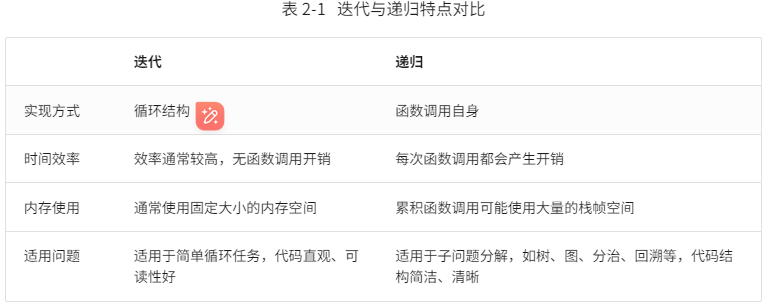

# Hello算法
https://www.hello-algo.com/

## 迭代
迭代是一种重复执行某个任务的控制结构
***for循环***是最常见的迭代形式之一，***适合在预先知道迭代次数时使用***
***while循环***  while更加灵活

## 递归
三个要素
1. 终止条件：用于决定什么时候由递转归
2. 递归调用：对应递，函数调用自身，通常输入更小或更简化的参数
3. 返回结果：对应归，将当前递归层级的结果返回到上一层

***普通递归***：求和操作是在“归”的过程中执行的，每层返回后都要再执行一次求和操作。
***尾递归***：求和操作是在“递”的过程中执行的，“归”的过程只需层层返回。
```c++
//尾递归
int tailRecur(int n, int res) {
	if (n == 1) {
		return 1;
	}

	return tailRecur(n - 1, res + n);
}

```
