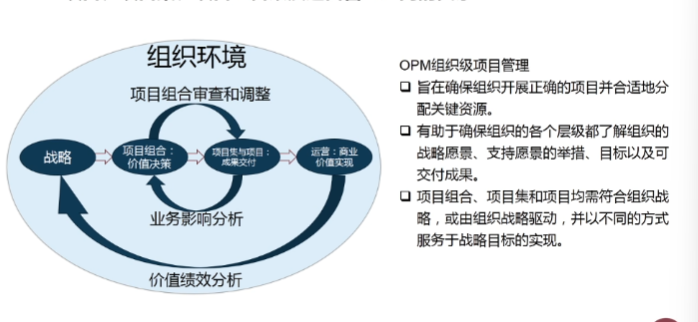
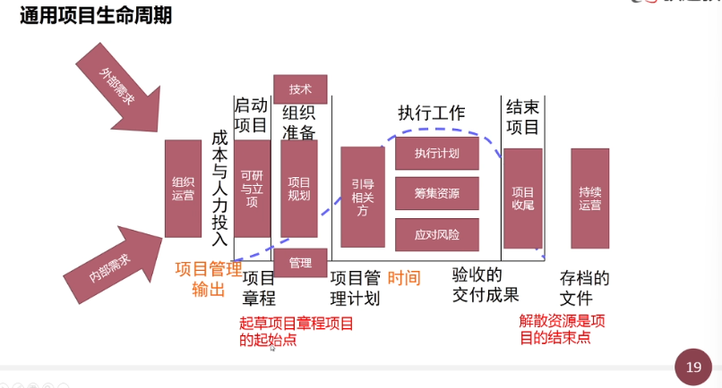
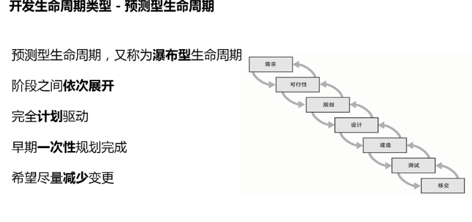
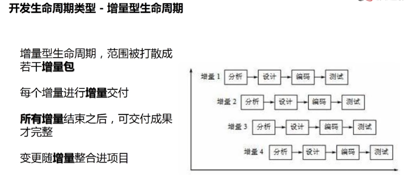
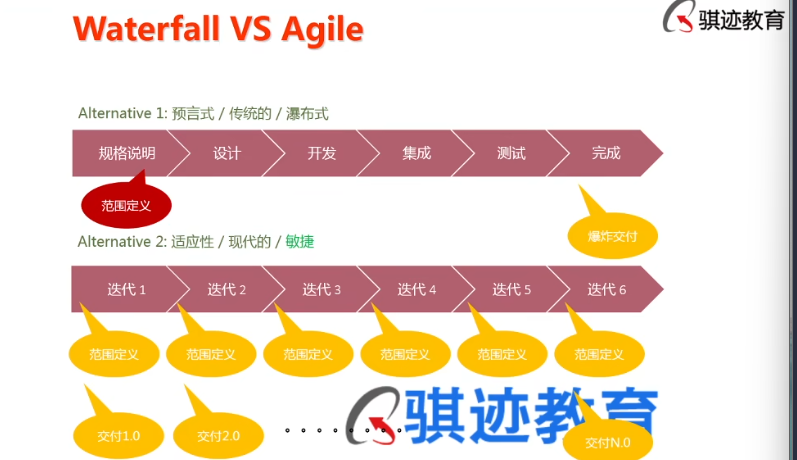

# PMP认证
    1.PMP基本算是所有项目管理的基准

    2.法律法规 当地文化 组织的规章制度  然后是责任 尊重 公正 诚实  这是要遵守的

## 项目
    项目是为创造【某种独特产品】，【服务或成果】所做的【临时性工作】  项目的产出成果叫做可交付物 deliverable 可交付的
    
    项目是临时性的 团队也是临时性的，也具有周期性 项目总归是有始有终的
    
    项目的独特性：  新产品 新服务  新成功
    元素的相似或重复 【不能改变】项目的独特性

    项目的临时性：临时指有明确的起点和终点
    项目的可交付成果可能会持续存在

    项目的渐进明细
        项目开始的时候风险最大，因为不确定性最大，风险在结束的时候风险最小，因为一切都确定了，人是一个项目中最大的不确定性
        随时间的推移，项目的可交付成功不断完成，项目的目标、内容、评估要求不断被丰富 明细化 具体化
        项目的风险不断出现
        假设和约束逐渐清晰
        大概这样-->基本是这样-->不是那样-->这样就对了

    项目是为了创造价值
        价值分有形效益（money 市场份额） 和  无形效益（商誉，品牌认知度，商标，战略一致性，声誉）

    
    项目  项目集  项目组合以及运营管理之间的关系
    愿景>使命>组织战略和目标>项目组合(分配资源和优先级)>项目集（协调 1+1>2）>项目
    项目组合管理的目的是为了实现组织战略和目标     

    愿景：愿景是一种状态
    使命：

    运营：是一种生产重复性结果的持续工作，他是根据制度化的标准，利用配给的资源，执行基本不变的作业
        持续不断和重复
        目标是维持经营

    项目：是为创造独特的产品，服务或成果而进行的临时性工作
        独特的和临时的
        目标是实现目标后结束

    项目与运行的联系：
        项目趋于结束，项目资源被转移到运营中
        组织开始时，运营资源被转移到项目中
        组织经常直接或间接利用项目，去实现战略规划中的目标

    OPM组织级项目管理
        opm是一个管理框架，管理规范

    一个项目的开始点是【项目章程得到批准】
    【解散资源】是项目的结束点

    开发生命周期类型 ---预测型生命周期
        预测型生命周期，又称为瀑布型生命周期 waterfall
        阶段之间【依次展开】，完全计划驱动，早期一次性规划完成，希望尽量减少变更

        瀑布型生命周期的交付是【爆炸性交付】一次全给你
        好处：如果一切都不变的话，预测型是最有效率的，前提是一切都不变，预测型比敏捷性是效率高的
        但是这个大前提一般很难满足
        预测型的生命周期，要有最大可能得详细的声明，最大可能得详细的项目范围定义

    开发生命周期类型---迭代型生命周期  适用于需要摸索的，比如手机的每年一迭代
        迭代型一向来没有完全的详细的项目范围定义
        迭代型生命周期，每个迭代是一个完整的生命周期
        每个迭代进行一次完整交付
        每个迭代内活动重复
        范围早期规划完成，其他估算定期完成
        变更随迭代整合进项目
        迭代型项目甚至可以推倒重来，他更多传承的是迭代的经验

    
    开发生命周期类型---增量型生命周期  项目不容易走回头路
        增量型生命周期，范围被打散成若干增量包
        每个增量进行增量交付
        【所有增量】结束之后，可交付成功才完整
        变更随增量整合进项目
        房子装修，硬装完之后的 软装就是增量的过程，打补丁也是增量

    开发生命周期类型---敏捷性生命周期
        敏捷性生命周期，线性的执行迭代
        每个迭代进行一次交付，提供一个可用版本
        每个迭代开始前，批准本迭代计划，并制定随后若干迭代的概要计划
        变更随迭代整合进项目
        特征：没有最大程度范围的详细定义，但是有最小范围的详细定义
            要有足够的反馈，不然的话不行，所以我们会想法设法获取用户反馈
        他是增量和迭代的组合

        
    瀑布型与敏捷性的区别

        
    