# PMP认证
    1.PMP基本算是所有项目管理的基准

    2.法律法规 当地文化 组织的规章制度  然后是责任 尊重 公正 诚实  这是要遵守的

## 项目
    项目是为创造【某种独特产品】，【服务或成果】所做的【临时性工作】  项目的产出成果叫做可交付物 deliverable 可交付的
    
    项目是临时性的 团队也是临时性的，也具有周期性 项目总归是有始有终的
    
    项目的独特性：  新产品 新服务  新成功
    元素的相似或重复 【不能改变】项目的独特性

    项目的临时性：临时指有明确的起点和终点
    项目的可交付成果可能会持续存在

    项目的渐进明细
        项目开始的时候风险最大，因为不确定性最大，风险在结束的时候风险最小，因为一切都确定了，人是一个项目中最大的不确定性
        随时间的推移，项目的可交付成功不断完成，项目的目标、内容、评估要求不断被丰富 明细化 具体化
        项目的风险不断出现
        假设和约束逐渐清晰
        大概这样-->基本是这样-->不是那样-->这样就对了

    项目是为了创造价值
        价值分有形效益（money 市场份额） 和  无形效益（商誉，品牌认知度，商标，战略一致性，声誉）

    
    项目  项目集  项目组合以及运营管理之间的关系
    愿景>使命>组织战略和目标>项目组合(分配资源和优先级)>项目集（协调 1+1>2）>项目
    项目组合管理的目的是为了实现组织战略和目标     

    愿景：愿景是一种状态
    使命：

    运营：是一种生产重复性结果的持续工作，他是根据制度化的标准，利用配给的资源，执行基本不变的作业
        持续不断和重复
        目标是维持经营

    项目：是为创造独特的产品，服务或成果而进行的临时性工作
        独特的和临时的
        目标是实现目标后结束

    项目与运行的联系：
        项目趋于结束，项目资源被转移到运营中
        组织开始时，运营资源被转移到项目中
        组织经常直接或间接利用项目，去实现战略规划中的目标

    OPM组织级项目管理
        opm是一个管理框架，管理规范

    一个项目的开始点是【项目章程得到批准】
    【解散资源】是项目的结束点

    开发生命周期类型 ---预测型生命周期
        预测型生命周期，又称为瀑布型生命周期 waterfall
        阶段之间【依次展开】，完全计划驱动，早期一次性规划完成，希望尽量减少变更

        瀑布型生命周期的交付是【爆炸性交付】一次全给你
        好处：如果一切都不变的话，预测型是最有效率的，前提是一切都不变，预测型比敏捷性是效率高的
        但是这个大前提一般很难满足
        预测型的生命周期，要有最大可能得详细的声明，最大可能得详细的项目范围定义

    开发生命周期类型---迭代型生命周期  适用于需要摸索的，比如手机的每年一迭代
        迭代型一向来没有完全的详细的项目范围定义
        迭代型生命周期，每个迭代是一个完整的生命周期
        每个迭代进行一次完整交付
        每个迭代内活动重复
        范围早期规划完成，其他估算定期完成
        变更随迭代整合进项目
        迭代型项目甚至可以推倒重来，他更多传承的是迭代的经验

    
    开发生命周期类型---增量型生命周期  项目不容易走回头路
        增量型生命周期，范围被打散成若干增量包
        每个增量进行增量交付
        【所有增量】结束之后，可交付成功才完整
        变更随增量整合进项目
        房子装修，硬装完之后的 软装就是增量的过程，打补丁也是增量

    开发生命周期类型---敏捷性生命周期
        敏捷性生命周期，线性的执行迭代
        每个迭代进行一次交付，提供一个可用版本
        每个迭代开始前，批准本迭代计划，并制定随后若干迭代的概要计划
        变更随迭代整合进项目
        特征：没有最大程度范围的详细定义，但是有最小范围的详细定义
            要有足够的反馈，不然的话不行，所以我们会想法设法获取用户反馈
        他是增量和迭代的组合

        
    瀑布型与敏捷性的区别

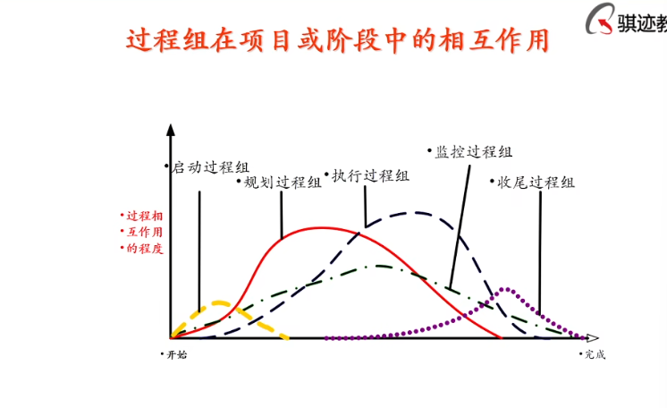
    
    监控过程组贯穿始终
        
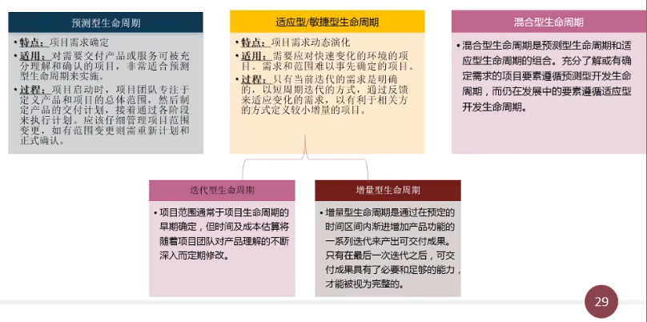

### 项目管理的五个过程组
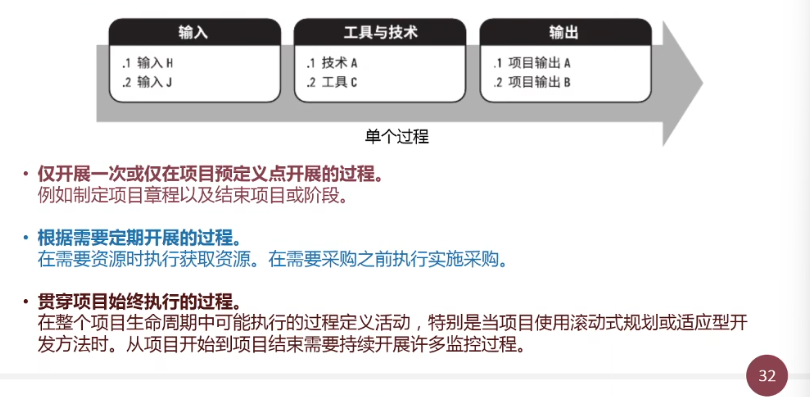

    类似于一天的吃喝拉撒的过程，每个过程都描述
    ITTO  input tool technology output
    输入-->工具和技术-->输出

    仅开展一次或仅在项目预定义点开展的过程
    例如制定项目章程以及结束项目或阶段

    根据需要定期开展的过程
    在需要资源时执行获取资源，在需要采购之前执行实施采购

    贯穿项目始终执行的过程
    在整个项目周期中可能执行的过程定义活动，特别是当项目使用滚动式规划或适应性开发方法事，
    从项目开始到项目结束需要持续开展许多监控过程
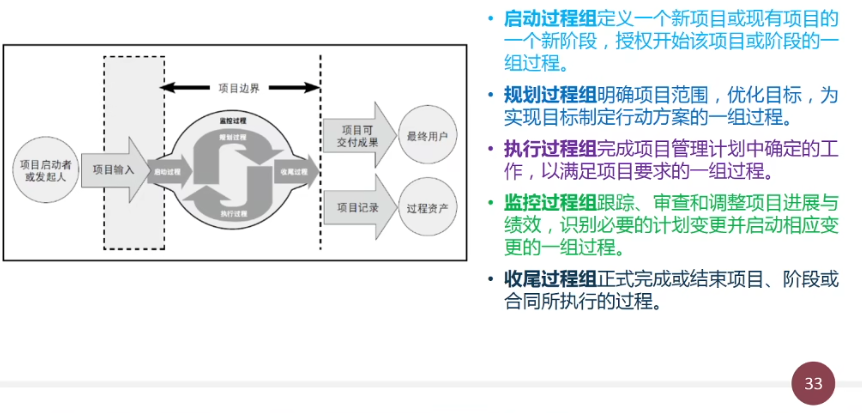
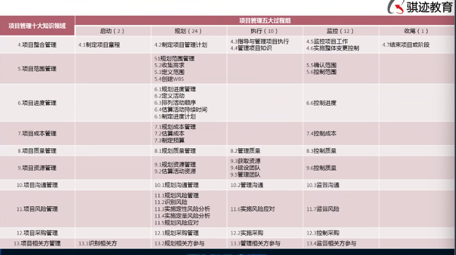
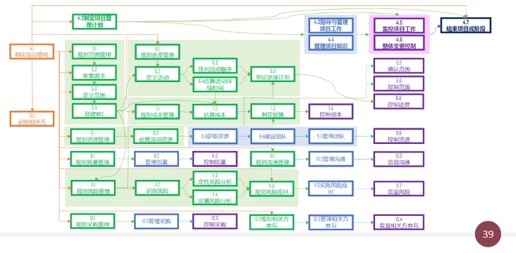
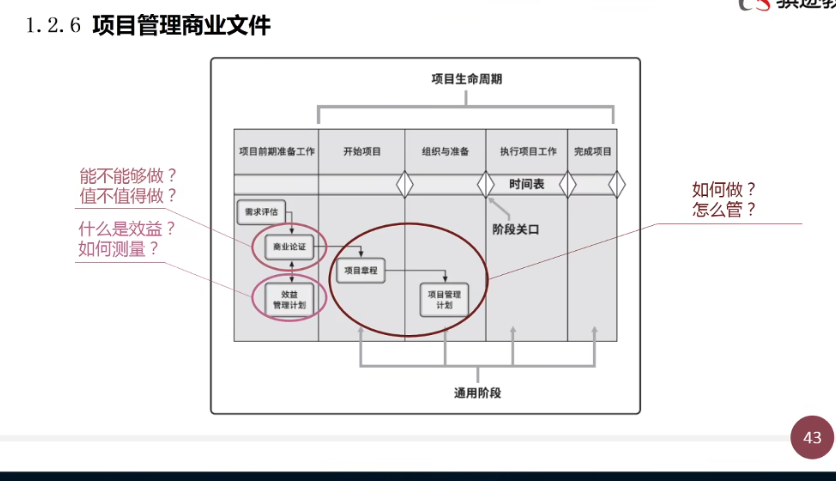

    效益管理计划是唯一一个在项目章程之前完成的计划，他体现的是高层和发起人的利益保障

    商业论证是立项前提
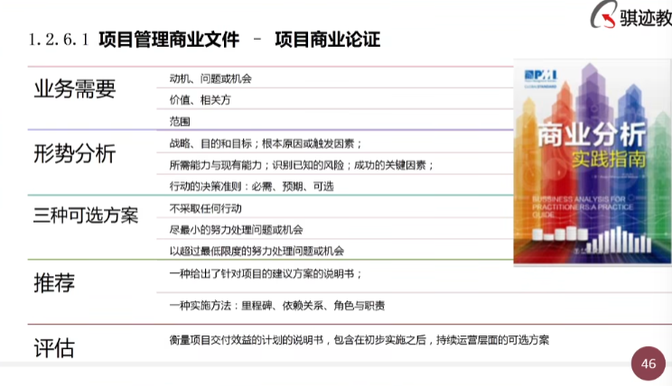

    财务指标 NPV IRR  ROI  公式里面的R是利率也叫利息也叫折现率
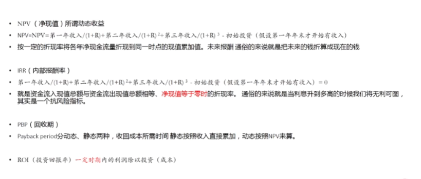

        NPV（净现值）所谓动态收益 通俗的来讲就是把未来的钱折算成现在的钱  >0 才叫赚钱
        IRR （内部报酬率）净现值等于0时的折现率  就是说我们当利息升到多高的时候 我们将无利可图
            这个其实是一个抗风险指标  考试的时候把答案中的R分别带入公式里，看哪个最接近0 哪个就是正确的
        PBP（回收期） 不足一年按一年算，自动进一
            分静态动态两种，收回成本所需时间按照收入直接累加，动态按照NPV来算，NPV就是要回收的钱
        
        ROI（投资回报率）【一定时期内】的利润除以成本  这个利润可能为NPV 看题目给没给利息
 

    需求可行性分析  商业论证  起草项目章程 

## 项目运行环境
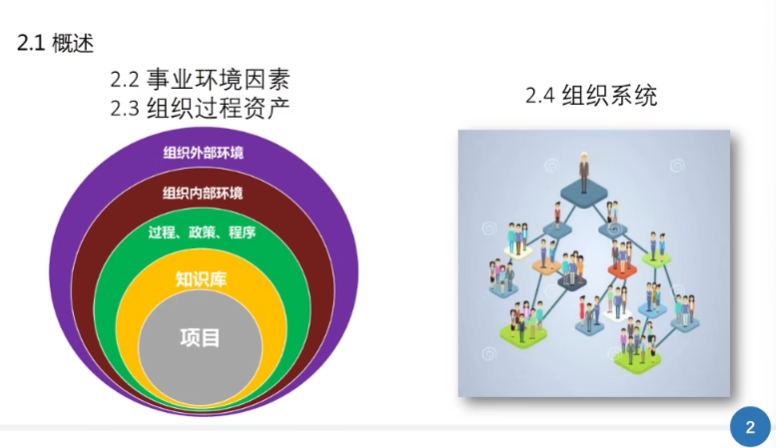
    
    事业环境因素：组织文化 结构和治理 算事业环境因素，员工的能力是事业环境因素，员工的能力短期内不能被改变，长期是可以的
    组织过程资产: 过程 政策和程序，组织知识库， 组织过程资产都是被归档过的文档，归档是经过专家或组织评定后的正确的文件，归档的重要性
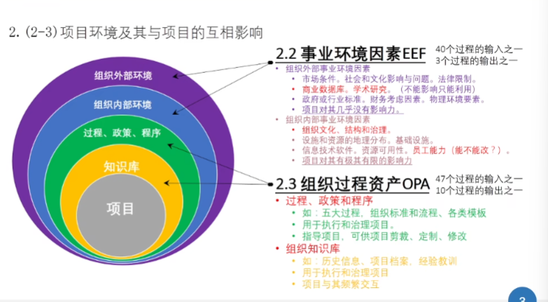
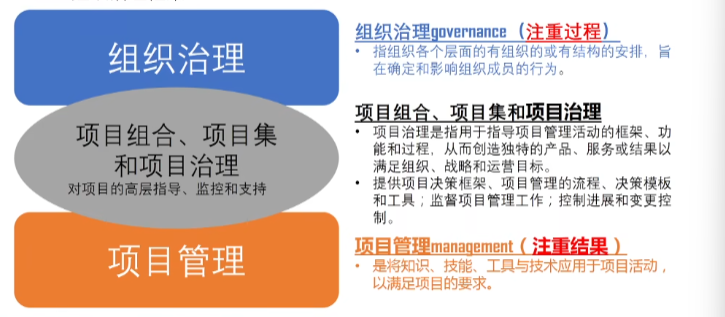

    组织治理：注重过程，按照组织的框架过程执行，审计就是一种组织治理
    项目管理：注重结果，无论怎么做 要把结果给组织，按时按量按质交给甲方 国内更关注管理，
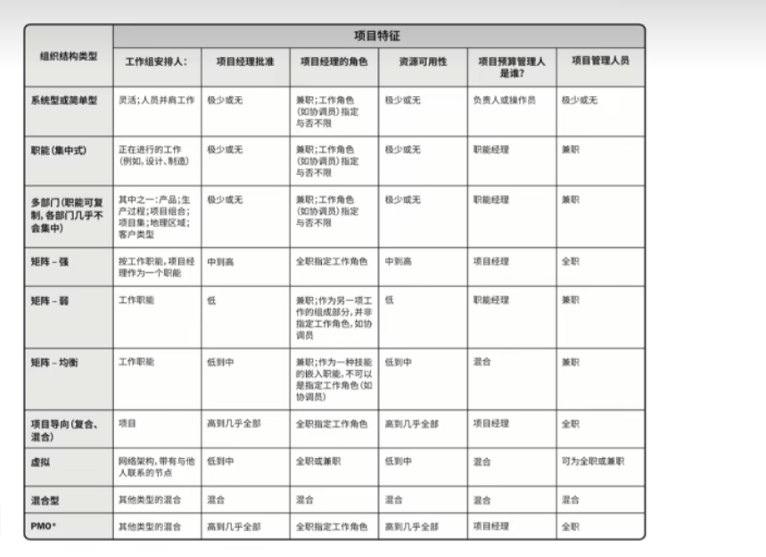

    组织结构类型 - 职能型组织 职能经理当项目经理
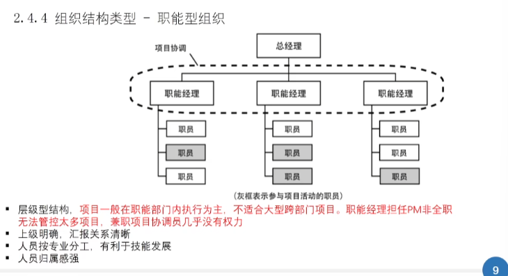

    组织结构类型 - 弱矩阵组织 一个部门下的职员当项目经理，但没有专业的项目经理
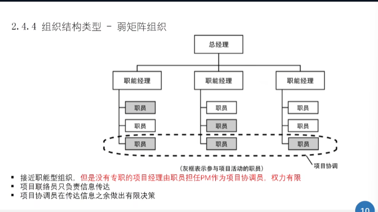
      
    组织结构类型 - 平衡矩阵组织 一个部门下的专业项目经理当项目经理，管理化水平高了
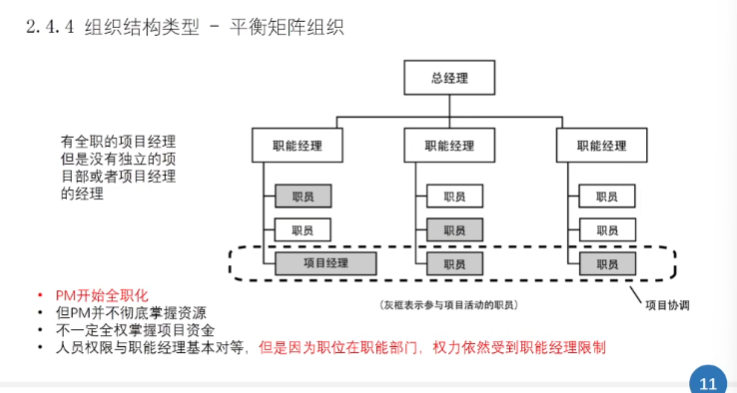

     组织结构类型 - 强矩阵组织 单独为项目经理们开一个部门，有独立的项目部 PM权利与职能经理相同，但是资源需要谈判
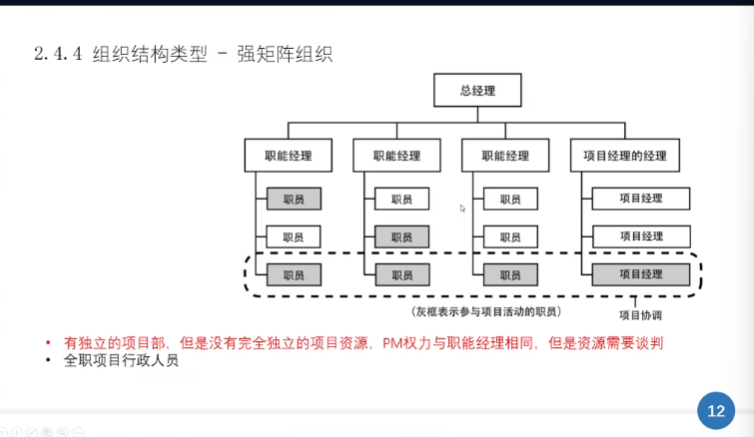

     组织结构类型 - 项目型组织 项目经理拥有很大的自主权和职权，有完全的资源调配权利
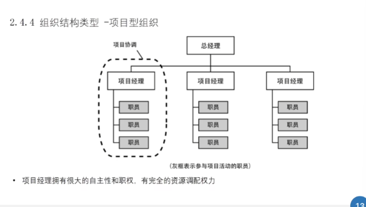

    组织结构类型 - 复合型组织 考试很喜欢 相比强矩阵矩阵多个圈 强矩阵的构架，强弱两个矩阵的形式
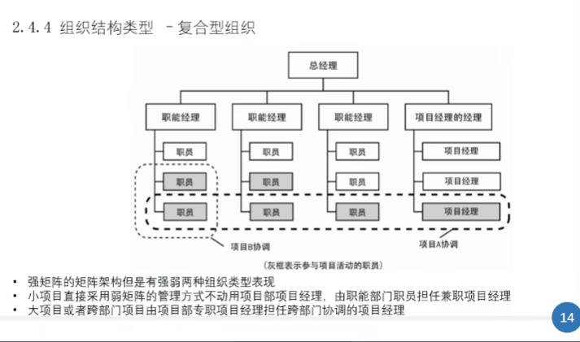
    
    组织结构特点
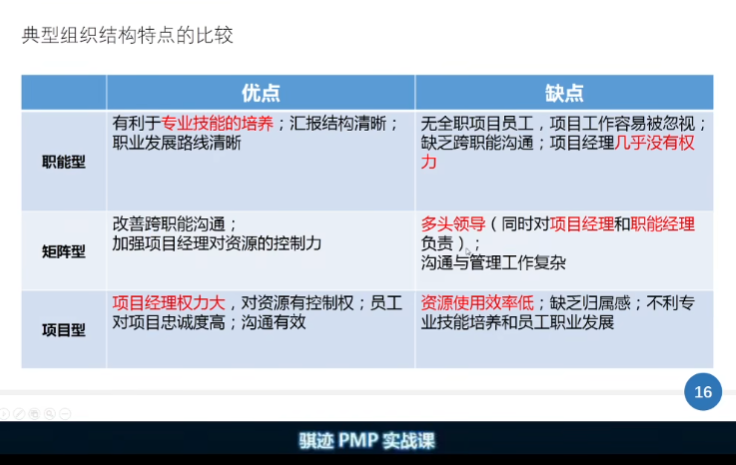

    项目管理办公室（PMO）制药行业 房地产企业  重装备制造  因为承受不了项目失败的后果所以需要PMO把控
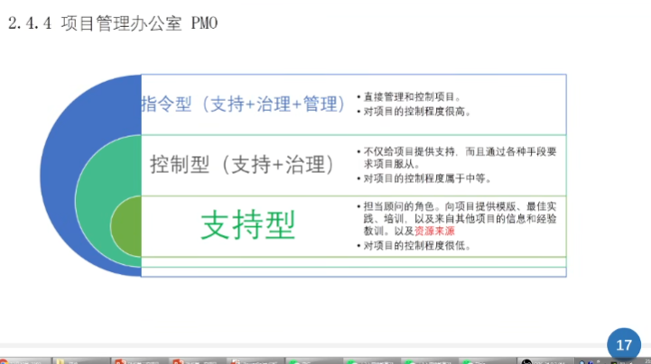
        
        更注重支持 管理 规范 
        组织过程资产，尤其是经验教训总结主要是通过PMO在不同项目之间传递的
        PMO也负责归档 历史经验等等
        支持型：PMO不直接提供资源，但是会提供资源来源 
        控制型（支持+治理）：可以通过各种手段要求项目服从
        指令型（支持+治理+管理）：直接管理和控制项目，对项目的控制程度很高
    PM和PMO的区别
        PM：项目成功
        PMO；整体项目的管理水平，能不能持续改进，能不能合理利用资源，并不关心项目是否成功，只关心过程是不是受控
    
    如果没有说明PMO的类型  默认是支持型

## 项目经理的定义和角色
    项目经理是由执行组织委派，领导团队实现项目目标的个人
    项目章程通过代表【项目确立要做】，【项目经理被正式授权了】
    项目经理一般不参与项目的具体工作
    项目的治理是由PMO治理
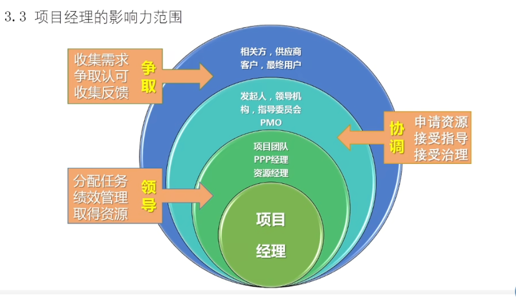

    项目经理在项目初期的天然盟友就是发起人
    找发起人一般是两件事 一个是要钱 一个是改项目章程

    
    项目经理在项目上的影响力
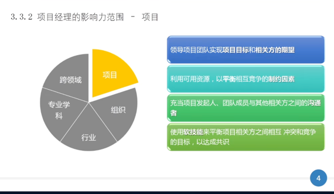

    在组织上的影响力
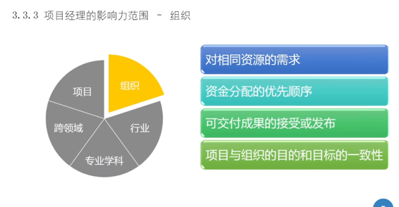

    对行业的影响力 很小很小
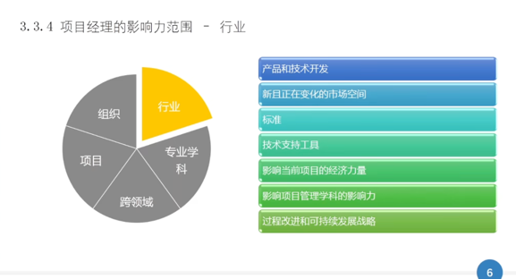

    对专业学科的影响
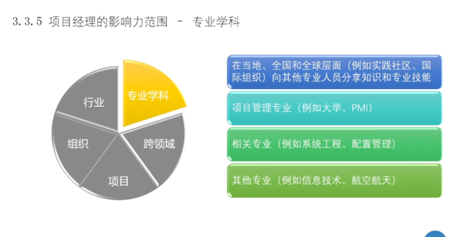
    
    产品经理：把产品做好，对外的
    项目经理：把产品做对，对内的，对团队 内部相关方负责
    
    项目经理能力三角
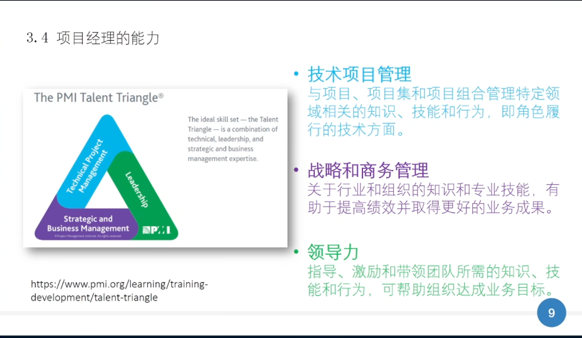

        技术项目管理
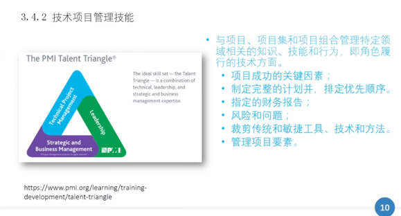

        战略和商务管理：关于行业和组织的知识和专业技能，有助于提交绩效并得到更好的业务成功
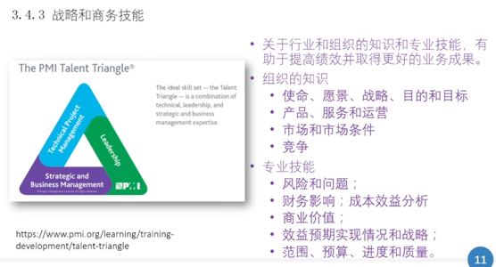

        领导力：指导、激励和带领团队所需的知识，技术和行为，可帮助组织达到业务目标
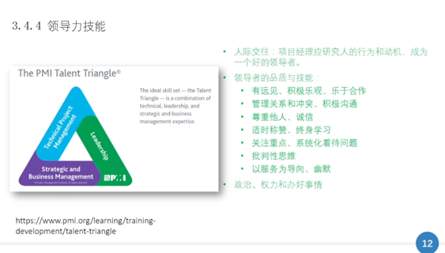
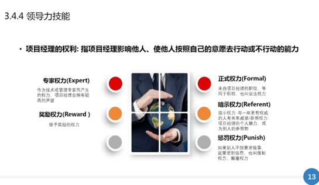

            专家权力
            奖励权力
            正式权力
            暗示权力：类似狐假虎威
            惩罚权力：用惩罚来彰显权力是最愚蠢的，惩罚权力要谨慎使用

        
        
        如何去争抢资源呢，你得说明你是符合组织的战略方向和需求的
         
        领导力最关键是要激发信任

        领导力和管理的比较
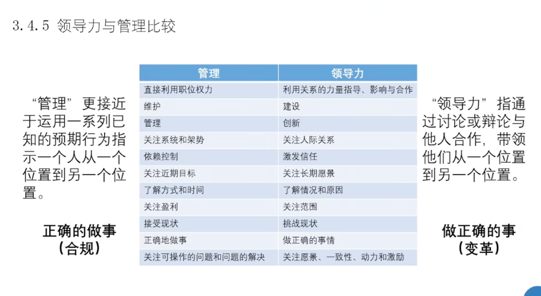

        领导力是做争取的事（变革）
        管理是正确的做事（规范）

        III适合做技术领军人物  企业喜欢II  IIII

        领导力的风格
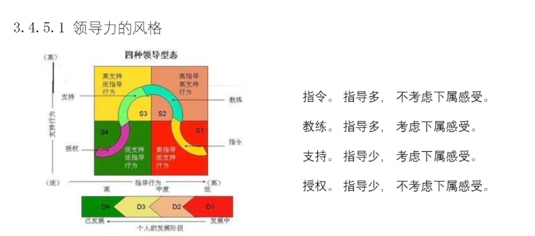

            指令：指导多，不考虑下属感受  适合项目需要快速做出结果，或者说项目团队人员文化水平素质不会很高，有些人只会听命令做事，初级岗位更多是等待指令干活，劳动密集型企业特点很注重听命令
            教练：指导多，考虑下属感受  领导一些风险高的项目，要大家齐心合力，需要团队的力量克服各种风险
            支持：指导少，考虑下属的感受
            授权：指导少，不考虑下属感受

## 项目整合管理
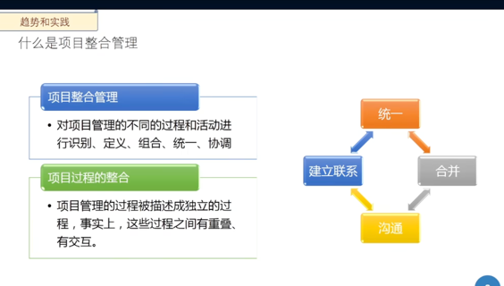
    
        项目整合管理：对项目管理的不同的过程和活动进行识别，定义，统一，协调
        项目过程的整合：项目管理的过程被描述成独立的过程，事实上，这些过程之间有重叠 有交互
    
        在项目中有的时候确实需要和稀泥，因为有的时候确实两边难成全
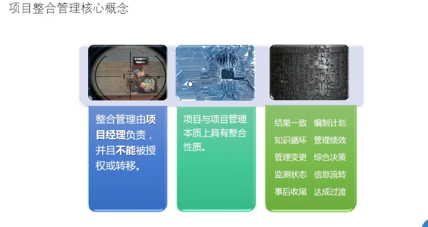

        整合管理由项目经理负责，并且不能被授权或转移
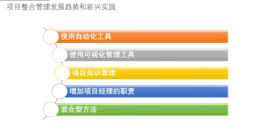
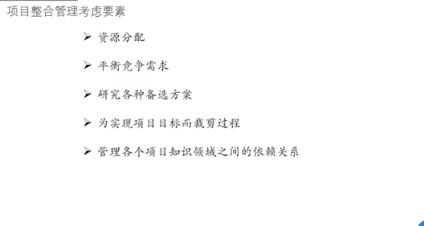

        项目整合管理考虑要求（针对一个项目内的）
            资源分配
            平衡竞争需求
            研究各种备选方案  重要事情一定要有备选方案
            为实现项目目标而裁剪过程
            管理各个项目知识领域之间的依赖关系

        可交付成果阶梯
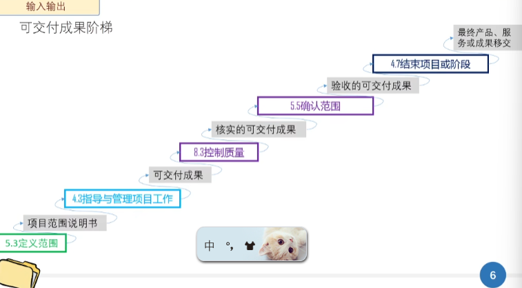

        工作绩效管理线
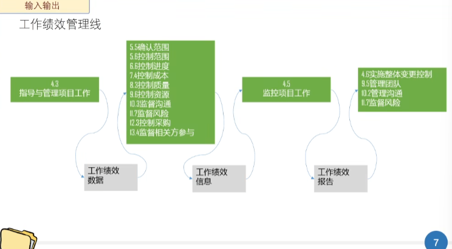

        变更管理环  任何变更都要走流程，要走步骤
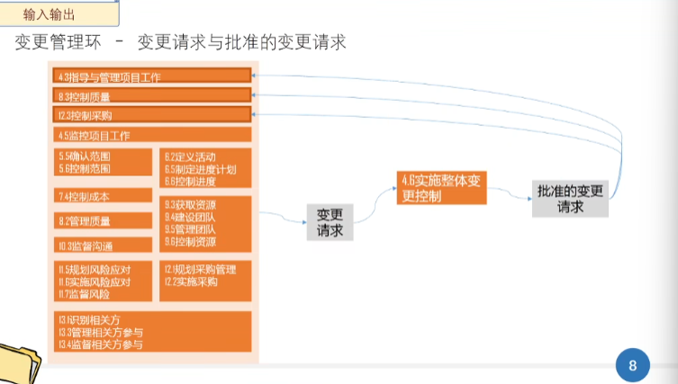

        项目管理过程框架要背下来
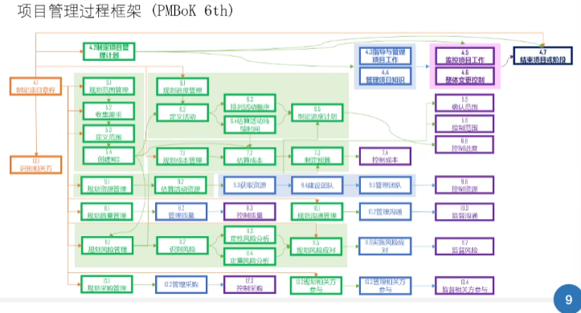

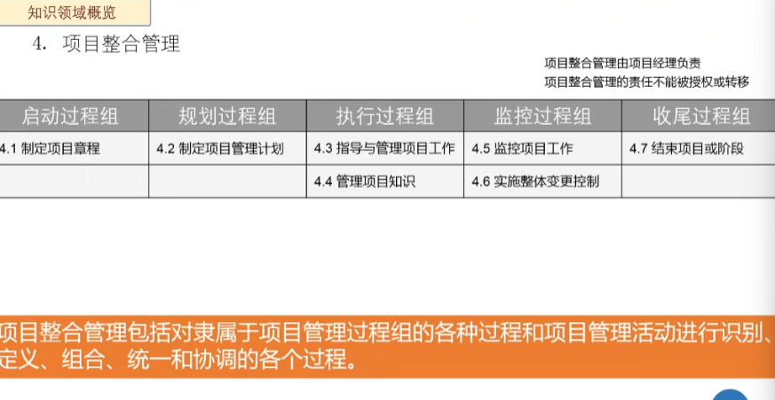
        