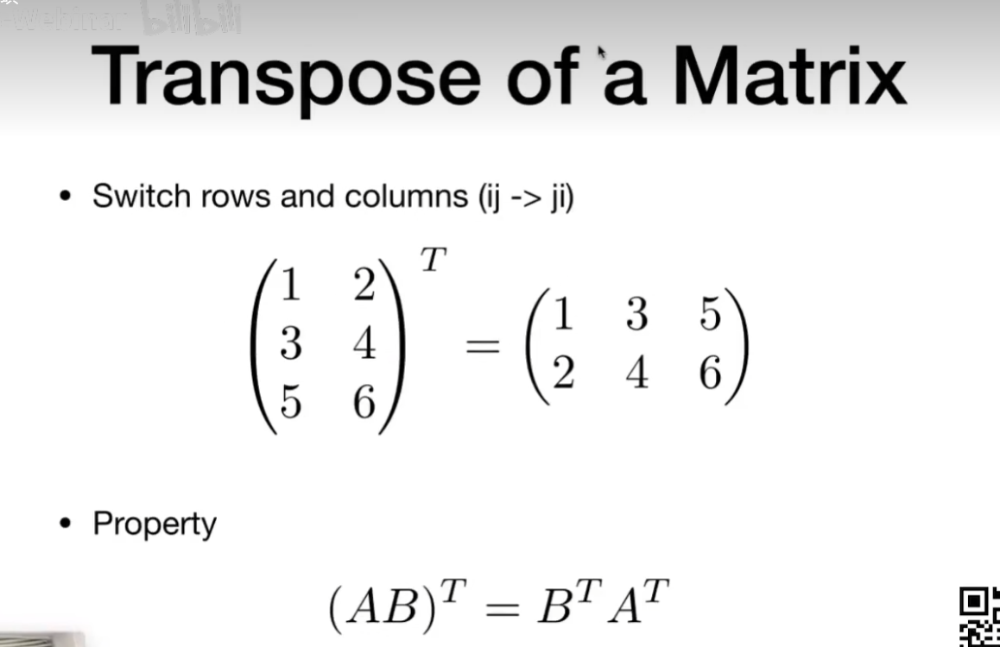
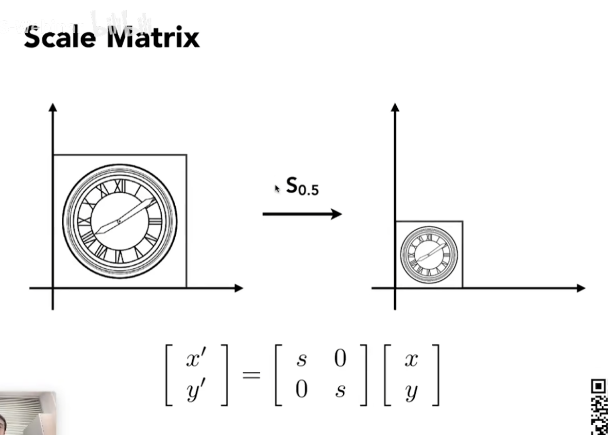
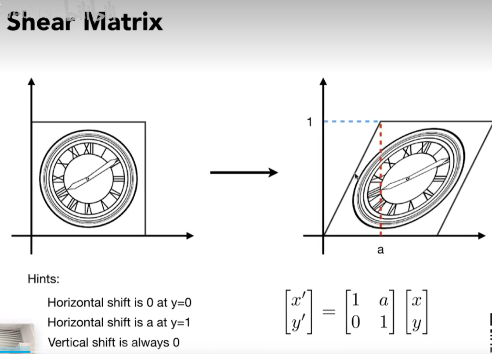
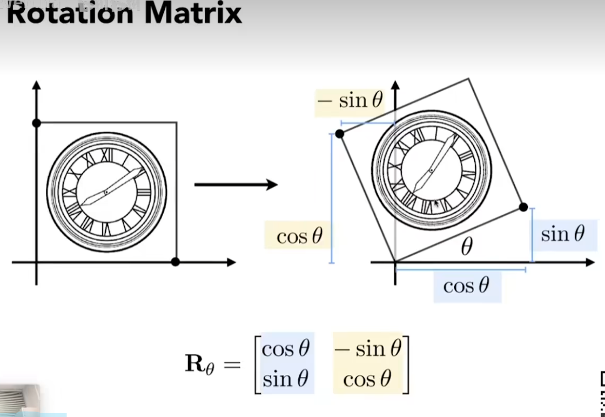
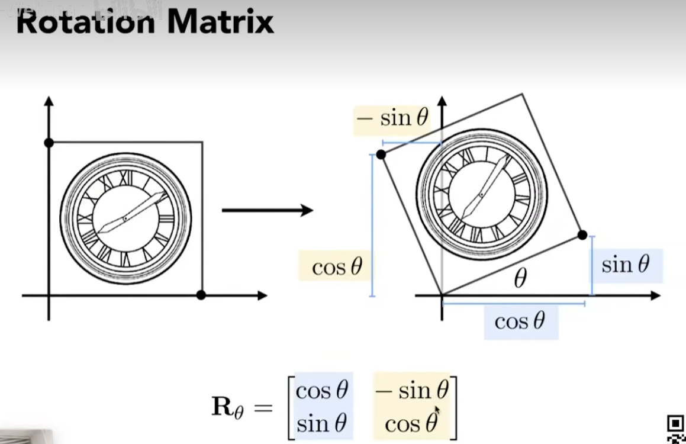
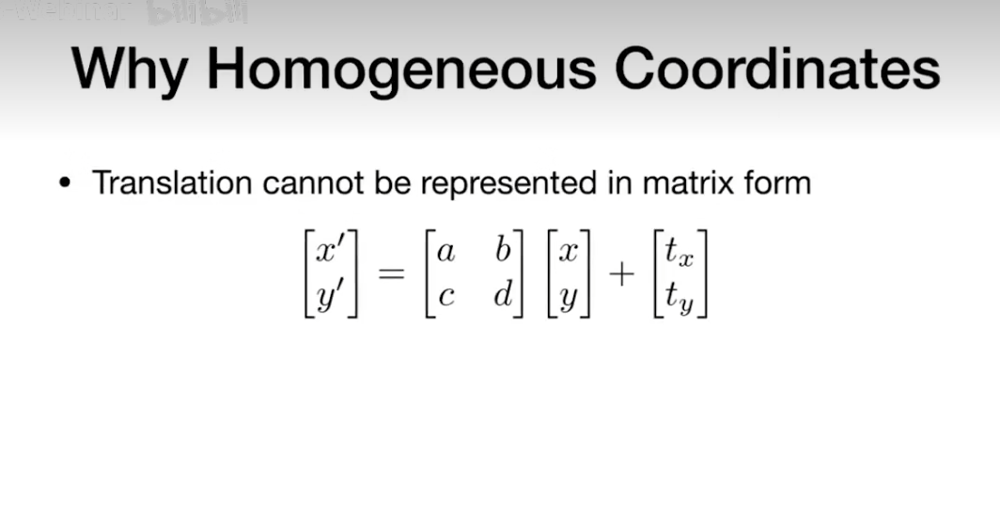

# 计算机图形学
图形学是一个非常广阔的世界

Rasterization 光栅化
实时：每秒生成30副画面至少
Ray Tracing 光线追踪
Animation 动画

## 向量（Vectors）
他表示的是一个方向

向量最重要的属性
1. 方向
2. 长度 

> 对一个向量平移他是不会变化的 因为A、B两点相对位置是没有发生变化的

单位向量=向量/向量长度   向量长度=||AB|| AB上面的箭头没写  这样单位向量就可以单纯表示方向

## 向量求和

计算的两个法则
1. 平行四边形法则 a和b**放在同一个起点**，然后a和b平移一段距离围成平行四边形
2. 三角形法则 ***向量收尾相接**拼起来，结果就是开头和结尾相连

默认向量的列向量，也可以变成行向量，转置后就是行向量

## 向量点乘和叉乘
1. 点乘    结果是一个数，也可以算出两个向量之间的夹角

   点乘满足基本的运算法则，交换律，分配律，结合律

   在坐标系下的向量点乘更简单

   点乘的作用就是找到两个向量之间的夹角，
   找b向量在a向量的投影，投影算出来的好处 可以把一个向量分解成两个向量 

   点乘可以判断出前与后

2. 叉乘 结果是一个向量

右手螺旋定责
a x b 手指弯曲 从a到b，大拇指的方向是叉乘出来的结果的方向

   叉乘没有交换律

   叉乘的作用 判断左和右  判断内和外 
   判断左右：a x b 值是正的就是左侧，负数就是右侧
   判断内外：各个向量叉乘 AP

## 矩阵 （Matrices）

   矩阵相乘AB!=BA
   交换律是没有的
   结合律和分配律是有的
   转置操作

   矩阵的逆

   向量的点乘和叉乘都可以转为矩阵形式

   a向量点乘b向量 可以理解为a竖向量的转置乘以b竖向量
   
## 变换（Transformation）
1. 模型变换 
   缩放

   矩阵表示的话就是一个对角阵，主对角线放缩放比例，其他位置为0，这个叫***缩放矩阵***

   对称映射，镜像操作,矩阵表示也是一个对角阵，主对角线只能为+1 -1

   切变：可以拽着一条边

   旋转（默认绕着原点旋转，默认逆时针方向）也有旋转矩阵，里面标的是长度 ，找两个特殊点 原来点的坐标 和旋转后点的坐标

   
2. 视图变换
3. 投影变换：相机拍照完 会把3D场景变2D

## 齐次坐标
平移变换比较特殊

但是发现无法写成矩阵形式！！！！！！！！！！！！！！！

要写成矩阵形式需要拆解开，把里面的加号也拆开
这种形式才能表示平移的操作，平移操作不属于***线性变换*** 所以引入***齐次坐标***
