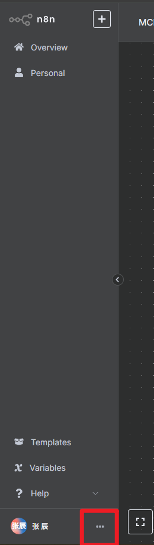
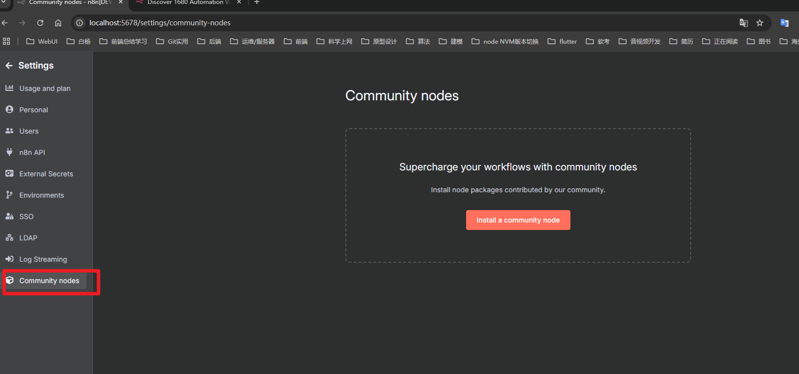
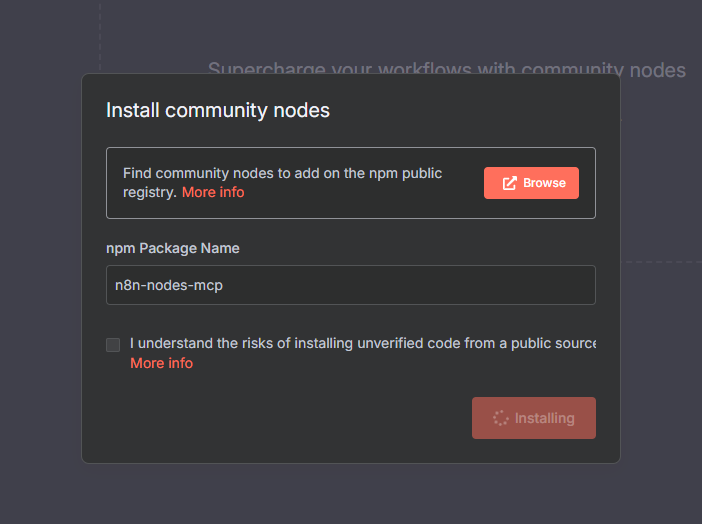
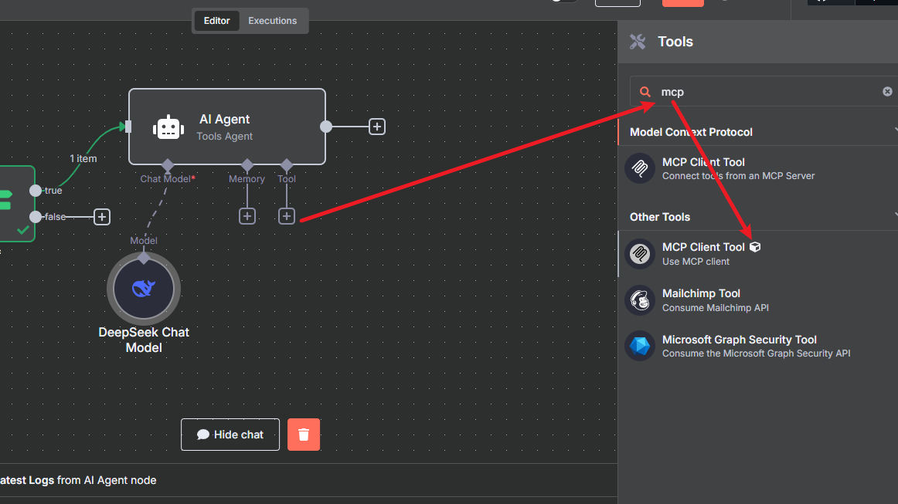
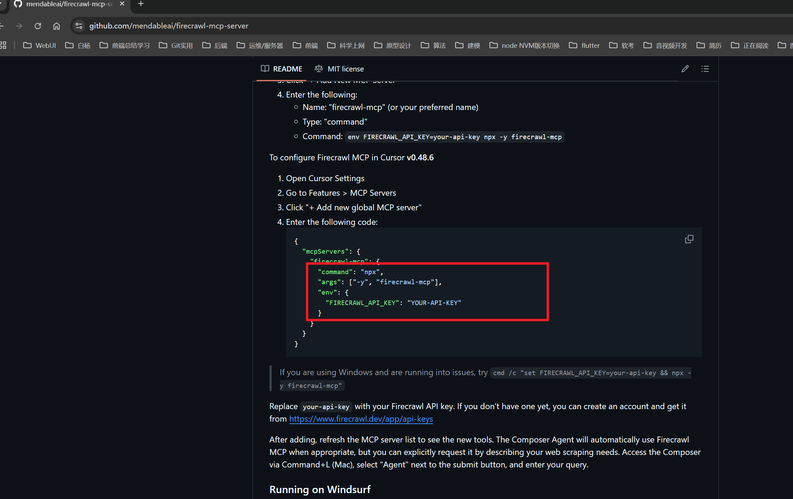
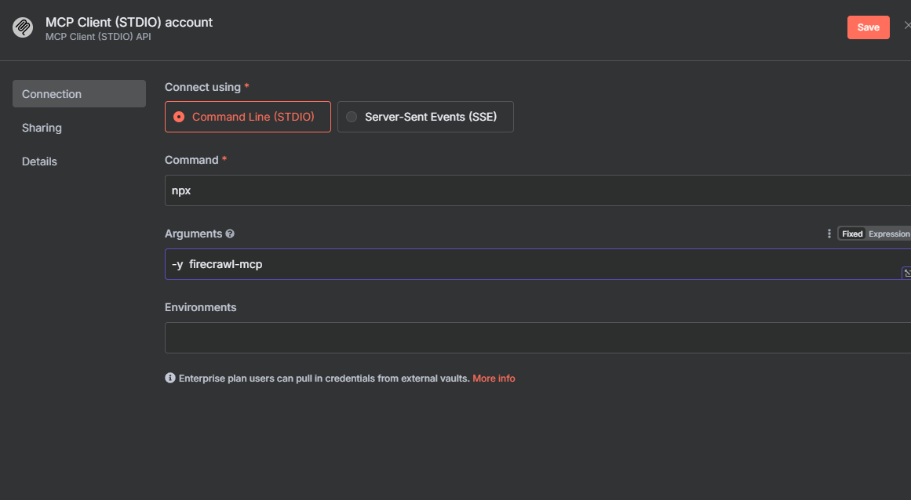

# N8N工作流（海外）
pm2这个工具看下   n8n支持的node版本 ***>=18  <=22***  !!!!!!!!!!

MPC服务n8n目前还没有官方节点
## 添加MCP节点步骤

deepseek的 apikey sk-c163c5a4be8c41019e64b56af4d152b8
这个代表是社区节点

https://github.com/modelcontextprotocol/servers?tab=readme-ov-file
这个是好多MCP服务的使用教程

样例

