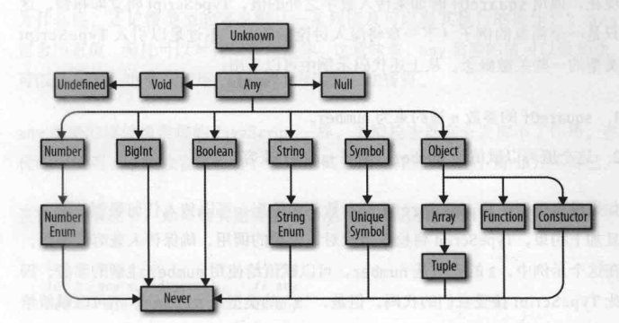
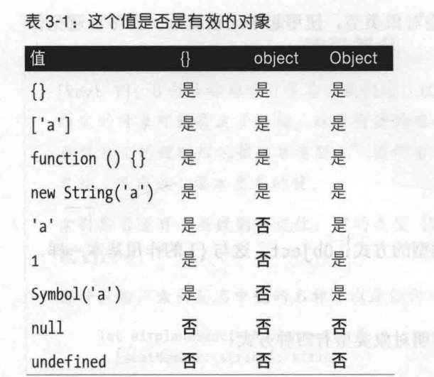

# TypeScript编程
练习链接
> https://github.com/bcherny/programming-typescript-answers

## 第一章 引言

### 类型安全
借助类型避免程序做无效的事情

## 第二章 TS概述
接受ts语言，概述ts编译器tsc的工作原理，开发中能用到的ts特性和模式

### 编译器
程序是由一些文件构成，文件是程序员编写的文本，这些文本由一个特殊的程序（称为编译器）解析，
转换成抽象语法树（AST）。AST是去掉了空白，注释和缩进用的制表符或空格之后的数据结构
编译器把AST转换成一种称为字节码的底层表示，字节码再传给运行时程序的计算，得到最终结果
也就是说，运行程序就是让运行时计算由编译器从源码解析得来的AST生成的字节码

> 步骤
> 1. 程序解析为AST
> 2. AST编译为字节码
> 3. 运行时计算字节码

但是TS比较特殊
他不直接编译成字节码，而是编译成js代码，然后在解析AST然后编译为字节码

TS编译器生成AST后，真正运行代码之前，TS会对代码做***类型检查***

### 类型检查器
检查代码是否符合类型安全要求的特殊程序
类型检查时TS的魔力所在，有了这一步，TS才能保证程序能按预期正常运行，没有显而易见的错误

TS的编译过程
1. TS源码->TS AST
2. 类型检查器检查AST
3. TS AST-> JS源码

4. JS源码-> JS AST
5. JS AST-> 字节码
6. 运行时计算字节码

在这个过程中，第1-2步使用程序的类型，第三步不适用
> 注意 TSC把ts编译成js时，不会考虑类型  类型只会在类型检查这一步使用

### 类型系统
类型检查器为程序分配类型时使用的一系列规则
一般来说，类型系统有两种，一种通过显式语法告诉编译器所有值的类型（java）
另一种自动推导值的类型（js）。这两种类型系统各有利弊

TS身兼两种类型系统，可以显式注解类型，也可以让TS推导多数类型

一般来说，最好让TS推导类型，少数情况下才显式注解类型

JS动态绑定类型，因此必须运行程序才能知道类型，在运行程序之前，JS对类型一无所知


### 准备环境
>  npm install typescript tslint @types/node
>  npx tsc --init

>  npx tsc .\index.ts 这样可以把一个ts编译为js


## 第三章 类型全解

### 类型
类型层次结构



#### any
any是类型的教父。为达目的，他不惜一切代价，但是不要轻易请他出面，除非迫不得已
在ts中，编译时一切一切都要有类型，如果你和ts无法确定类型是什么，默认是any
这是兜底类型，应该尽量避免使用

#### unknown
如果any是教父，那么unknown就是与坏人同流合污，但是内心却尊重法律，站在好人这一边
少数情况下，如果你确实无法预知一个值的类型，不要使用any，应该使用unknown
与any类似，unknown也表示任何值，但是ts会要求你再做检查，细化类型

unknown 支持 == === || && ? 可以否定 可以使用typeof instanceof运算符

1. ts不会把任何值推导为unknown，必须显式注解
2. unknown类型的值可以比较
3. 执行操作时，不能假定unknown类型的值为某种特定类型，必须向ts证明一个值确实是某个类型
```ts
let aa:unknown =10
let bb =20
let cc=aa+bb //会报错 aa is of type unknown
if(typeof aa ==='number'){
    let dd=aa+bb  //不报错
}
```

#### boolean
很简单

#### 类型字面量
仅表示一个值的类型
```ts
let e:true=true
```

#### number
```ts
let f:26.218=26.218
let c:number=5.12
```

#### bigint
bigint 是js与ts新引入的类型，在处理较大的整数时，不用再担心舍入误差
```ts
let f:bigint=100n //要这么使用
let d:bigint=100 //这个会报错
```

#### string
简单

#### symbol
在js中Symbol('a')使用指定的名称新建一个符号，这个符号是唯一的，不与其他任何符号相等（使用==或===比较）
即便再使用相同的名称创建一个符号也是如此
```ts
let a:symbol=Symbol('a')
```

#### 对象
这个就有点东西了
```ts
let a:object ={
    b:"123"
}
console.log(a.b) //TS2339: Property b does not exist on type object
```
其实object仅比any的范围窄些，但也窄不了多少。object对值知之甚少，只能表示该值是一个js对象（而且不是null）
{} 除 null 与undefined 之外的任何类型都可以赋值给空对象类型，尽量避免使用这个
另外还有就是Object 这个O是大写的,他与{}的作用基本一样，最好也避免使用


#### 类型别名
```ts
type Age=number  //但是同一个类型 不能声明两次
type Person= {
    name:string;
    age:Age
}
```
类型别名也有块级作用域 ！ 这个之前不知道
```ts
type color = 'red'
let x =Math.random() < .5
if(x){
    type color ='blue'
    let b:color='blue'
}else {
    let b:color='red'
}
```

#### 交集&并集
并集使用| 交集使用&  通常我们用并集用的多
A | B（并集）：可以是 A 或者 B（或者同时满足 A 和 B，但不是必须）。
A & B（交集）：必须同时是 A 和 B（不能只满足其中一个）。
满足指的是实现type里的所有属性
```ts
type cat ={
    name:string
    purrs:boolean
}

type dog ={
    name:string
    barks:boolean
    wags:boolean
}
type catOrDogOrBoth= cat | dog   //至少满足 Cat 或 Dog 的属性集 或都满足
type catAndDog = cat & dog // 必须满足 Cat 和 Dog 的所有属性


```


#### 数组
与对象一样，使用const声明的数组不会导致ts推导出范围更窄的类型
有个特殊的情况,如果刚开始数组为空还没有定义数组类型,这是个极特殊的情况
```ts
function buildArray(){
    let a=[] // any[]
    a.push(1)   // number[]
    a.push("a") // (string | number)[]
    return a
}
let arr3=buildArray()  //(string | number)[]
arr3.push(true) // 所以会报错
```

#### 元组
元组是array的子类型，是定义数组的一种特殊方式，长度固定，各索引位置上的值具有固定的已知类型
与其他多数类型不同，声明元组必须显式注解类型
```ts
const cc:[number]=[1]
const dd:[string,string,number]=['go','zp',20]
const ee:[string,number?]=["123"]

const ff:[string,number,...boolean[]]=["gg",123,false,true]  //还支持剩余元素，方便拓展

```
