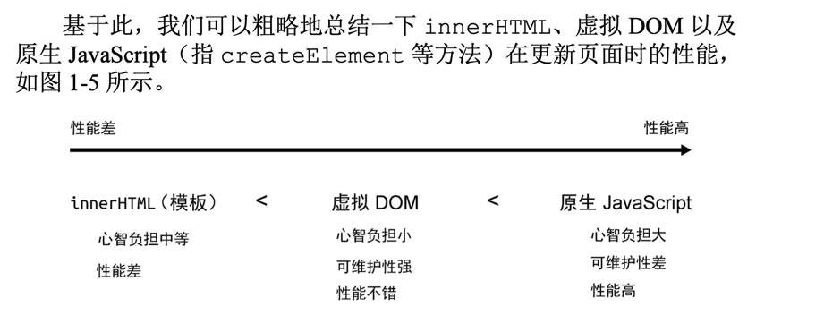

# Vue.js设计与实现



虚拟DOM的意义就在于使找出差异的性能消耗最小化

vuejs 是编译+运行时

死代码消除
这时我们发现这
段分支代码永远都不会执行，因为判断条件始终为假，这段永远不会
执行的代码称为 dead code，它不会出现在最终产物中，在构建资源的
时候就会被移除

死代码消除（Dead Code Elimination）

死代码消除的原理是：编译器在构建过程中分析代码逻辑，判断哪些代码片段永远不会被执行，例如 if (false) 或 if (process.env.NODE_ENV === 'production') 在某些场景下始终为 false，这类代码块被认为是无效的，最终不会出现在打包后的文件中。
Rollup 如何进行死代码消除

1.	Tree Shaking：
    •	Rollup 的 Tree Shaking 机制会通过静态分析依赖关系来移除那些没有被使用或引用的模块和代码。Rollup 会检查哪些模块和变量在代码中是未被使用的，然后移除它们，从而减小打包文件的体积。
2. 条件判断优化：
   •	在构建生产环境代码时，Rollup 通常会结合一些工具或插件（如 @rollup/plugin-replace）替换掉某些常量，比如 process.env.NODE_ENV === 'production' 这样的条件。在生产构建时，这个条件会被替换为 true 或 false。如果条件始终为 false，对应的代码分支就会被标记为“死代码”并被移除。

Tree-Shaking 因rollup.js而不普及
简单说就是消除那些永远不会被执行的代码
现在rollup webpack都支持
但是要实现tree-shaking 必须满足一个条件，那就是模块必须是esm 因为tree-shaking依赖esm的静态结构

tree-shaking中的第二个关键点--副作用
如果一个函数调用会产生副作用，那就不能将其一出，

副作用:调用函数的时候会对外部产生影响

例如修改 了全局变量。这时你可能会说，上面的代码明显是读取对象的值，怎
么会产生副作用呢？其实是有可能的，试想一下，如果 obj 对象是一
个通过 Proxy 创建的代理对象，那么当我们读取对象属性时，就会触
发代理对象的 get 夹子（trap），在 get 夹子中是可能产生副作用
的，例如我们在 get 夹子中修改了某个全局变量。而到底会不会产生
副作用，只有代码真正运行的时候才能知道，JavaScript 本身是动态语
言，因此想要静态地分析哪些代码是 dead code 很有难度，上面只是举
了一个简单的例子。

因为静态地分析 JavaScript 代码很困难，所以像 rollup.js 这类工具
都会提供一个机制，让我们能明确地告诉 rollup.js：
“放心吧，这段代
码不会产生副作用，你可以移除它。”具体怎么做呢？如以下代码所
示，我们修改 input.js 文件：

```js
 import {foo} from './utils'

 /*#__PURE__*/ foo()
```

注意注释代码 /*#__PURE__*/，其作用就是告诉 rollup.js，对于
foo 函数的调用不会产生副作用，你可以放心地对其进行 Tree-
Shaking，此时再次执行构建命令并查看 bundle.js 文件，就会发现它的
内容是空的，这说明 Tree-Shaking 生效了。

基于这个案例，我们应该明白，在编写框架的时候需要合理使用
/*#__PURE__*/ 注释。


***组件就是一组DOM元素的封装***
组件的返回值其实也是虚拟DOM
```js
 const MyComponent = function () {
     return {
         tag: 'div',
         props: {
         onClick: () => alert('hello')
         },
         children: 'click me'
     }
 }
```
```js
 const vnode = {
     tag: MyComponent
 }
```
就像 tag: 'div' 用来描述 <div> 标签一样，tag:
MyComponent 用来描述组件，只不过此时的 tag 属性不是标签名
称，而是组件函数。为了能够渲染组件，需要渲染器的支持。修改前
面提到的 renderer 函数，如下所示：
```js
 function renderer(vnode, container) {
     if (typeof vnode.tag === 'string') {
     // 说明 vnode 描述的是标签元素
         mountElement(vnode, container)
     } else if (typeof vnode.tag === 'function') {
     // 说明 vnode 描述的是组件
         mountComponent(vnode, container)
     }
 }

```
来看 mountComponent 函数是如何实现的： 其实很简单，就是用我们上面写的挂载DOM的那个函数
```js
 const vnode = {
    tag: MyComponent
 }


 function mountComponent(vnode, container) {
     // 调用组件函数，获取组件要渲染的内容（虚拟 DOM）
     const subtree = vnode.tag()
     // 递归地调用 renderer 渲染 subtree
     renderer(subtree, container)
 }

```

组件不一定得是函数，可以是对象

```js
 // MyComponent 是一个对象
 const MyComponent = {
    render() {
         return {
             tag: 'div',
             props: {
                 onClick: () => alert('hello')
             },
             children: 'click me'
         }
     }
 }
```
***vue.js中的有状态组件就是使用对象结构来表达的***


无论是手写虚拟DOM（渲染函数，也就是我们上面写的那些）还是使用模块，都属于声明式的描述ui，vue同时支持这两种描述ui的方式，上面我们讲解了
虚拟DOM是如何渲染成真实DOM的，那么模板是如何工作的，这就要提到vue框架中另外一个重要组成部分，***编译器***

编译器和渲染器一样，只是一段程序而已，不过他们的工作内容不同，编译器的作用就是将模版编译成渲染函数，可以理解为编译成虚拟DOM
编译器的***作用***
```html
 <div @click="handler">
     click me
 </div>
```
编译后
```js
 render() {
     return h('div', { onClick: handler }, 'click me')
 }


```

无论是使用模版（.vue文件）还是直接手写渲染函数，对于一个组件来说，他要渲染的内容最终都是通过渲染函数产生的
然后渲染器咋把渲染函数返回的虚拟DOM渲染为真实DOM，这就是模版的工作原理 也是vue渲染页面的流程


组件的实现依赖于渲染器，模版的编译依赖于编译器，而且编译后生成的代码是根据渲染器和虚拟DOM的设计决定的

vuejs是一个声明式的框架，声明式的好处在于，他直接描述结果，用户不需要关注过程
vue采用模版的方式来描述ui，但也支持使用虚拟dom来描述ui
虚拟dom要比模版更加灵活，但模版比虚拟dom更加直观

渲染器的作用
    把虚拟dom对象渲染成真实dom元素，他的工作原理是递归的遍历虚拟dom对象，并调用原生dom api来完成真实dom的创建，
渲染器的精髓在于后续的更新，他会通过diff算法找出变更点

组件其实就是一组虚拟dom元素的封装，他可以是一个返回虚拟dom的函数，也可以是一个对象，但这个对象必须要有一个函数来产出组件要渲染的虚拟dom

vue的模版会被一个叫做编译器的程序编译为渲染函数 


响应系统也是vue的重要组成部分 vue3采用proxy实现响应式数据

副作用函数指的是会产生副作用的函数
```js
function effect() {
 document.body.innerText = 'hello vue3'
 }
```
当effect函数执行时，他会设置body的文本内容，但除了effect函数之外的任何函数都可以读取或者设置body的文本内容，
也就是说effect函数的执行会直接或间接影响其他函数的执行，这时我们说effect函数产生了副作用。副作用很容易产生，
例如一个函数修改了全局变量，这其实也是一个副作用
```js
// 全局变量
 let val = 1

 function effect() {
 val = 2 // 修改全局变量，产生副作用
 }
```

下面我们讨论如何让数据变成响应式数据

```js
 const obj = { text: 'hello world' }
 function effect() {
 // effect 函数的执行会读取 obj.text
 document.body.innerText = obj.text
 }
```
当副作用函数effect执行时会触发obj.text的读取操作
当修改obj.text的值时，会触发obj.text的设置操作

如果我们能拦截一个对象的读取和设置操作，事情就变简单了
当读取字段obj.text时，我们可以把副作用函数effect存储到一个“桶”里


接着 当设置obj.text时，再把副作用函数effect从“桶”里取出并执行即可


根据以上的思路我们实现下 利用proxy
```js
//存储副作用的桶
const bucket = new Set();

//原始值
const data = {
  text: "hello world",
};

const effect = () => {
  document.body.innerText = obj.text;
};

//对原始数据代理
const obj = new Proxy(data, {
  get(target, key) {
    console.log("触发了代理的get");
    //把副作用函数effect添加到存储副作用的桶中
    bucket.add(effect);

    return target[key];
  },
  set(target, key, value) {
    console.log("触发了代理的set");
    //设置属性值
    target[key] = value;

    //把副作用从桶里取出来执行
    bucket.forEach((fn) => fn());

    //return true代表成功
    return true;
  },
});

effect();

setTimeout(() => {
  obj.text = "hello vue3";
}, 1000);

```
在浏览器中运行，会得到期望结果
但是目前还存在缺陷，例如我们直接通过名字（effect）来获取副作用函数，这种硬编码的方式很不灵活。副作用函数的名字可以任意取，因此我们要想办法去掉这种硬编码的机制

```js
//存储副作用的桶
const bucket = new Set();

//原始值
const data = {
  text: "hello world",
};
//用一个全局变量存储被注册的副作用函数
let activeEffect;

const effect = (fn) => {
  activeEffect = fn;
  fn();
};

//对原始数据代理
const obj = new Proxy(data, {
  get(target, key) {
    console.log("触发了代理的get");
    //把副作用函数effect添加到存储副作用的桶中
    if (activeEffect) {
      bucket.add(activeEffect);
    }

    return target[key];
  },
  set(target, key, value) {
    console.log("触发了代理的set");
    //设置属性值
    target[key] = value;

    //把副作用从桶里取出来执行
    bucket.forEach((fn) => fn());

    //return true代表成功
    return true;
  },
});

effect(() => {
  document.body.innerText = obj.text;
});

setTimeout(() => {
  obj.text = "hello vue3";

    // obj.notExist = "hello vue3";  这个也会触发副函数执行，这是我们桶的设置问题 
}, 1000);

```
如上面的代码所示，由于副作用函数已经存储到了activeEffect中，所有在get拦截函数内就应该吧activeEffect收集到桶中，这样响应系统就不依赖副作用函数的名字了
匿名副作用函数内部读取了字段 obj.text 的值，于 是匿名副作用函数与字段 obj.text 之间会建立响应联系。接着，我 们开启了一个定时器，一秒钟后为对象 obj 添加新的 notExist 属 性。我们知道，在匿名副作用函数内并没有读取 obj.notExist 属性
的值，所以理论上，字段 obj.notExist 并没有与副作用建立响应联 系，因此，定时器内语句的执行不应该触发匿名副作用函数重新执 行。但如果我们执行上述这段代码就会发现，定时器到时后，匿名副
作用函数却重新执行了，这是不正确的。为了解决这个问题，我们需要***重新设计“桶”的数据结构***

我们应该建立副作用函数与被操作的目标字段之间建立明确的联系
我们要使用weakMap代替set


map和weakmap的区别
```js
const map = new Map();
const weakMap = new WeakMap();

(function () {
    const foo = { foo: 1 };

    const bar = { bar: 2 };

    map.set(foo, 1);
    weakMap.set(bar, 2);
})();
console.log(
    "map",
    map.keys().forEach((item) => {
        console.log("item", item.foo);
    }),
);
console.log("weakMap", weakMap);

console.log("map", map.get("foo"));
console.log("weakMap", weakMap.get("bar"));


```
首先，我们定义了 map 和 weakmap 常量，分别对应 Map 和 WeakMap 的实例。接着定义了一个立即执行的函数表达式（IIFE），
在函数表达式内部定义了两个对象：foo 和 bar，这两个对象分别作 为 map 和 weakmap 的 key。当该函数表达式执行完毕后，对于对象
foo 来说，它仍然作为 map 的 key 被引用着，因此垃圾回收器 （grabage collector）不会把它从内存中移除，
我们***仍然可以通过 map.keys 打印出对象 foo***。然而对于对象 bar 来说，由于 WeakMap 的 key 是弱引用，它不影响垃圾回收器的工作，所以一旦表达式执行 完毕，垃圾回收器就会把对象 bar 从内存中移除，并且我们无法获取
weakmap 的 key 值，也就无法通过 weakmap 取得对象 bar。 简单地说，WeakMap 对 key 是弱引用，不影响垃圾回收器的工
作。据这个特性可知，一旦 key 被垃圾回收器回收，那么对应的键和 值就访问不到了。所以 WeakMap 经常用于存储那些只有当 key 所引
用的对象存在时（没有被回收）才有价值的信息，例如上面的场景 中，如果 target 对象没有任何引用了，说明用户侧不再需要它了，
这时垃圾回收器会完成回收任务。但如果使用 Map 来代替 WeakMap， 那么即使用户侧的代码对 target 没有任何引用，这个 target 也不
会被回收，最终可能导致内存溢出

```js
///重构后
//存储副作用的桶
const bucket = new WeakMap();

//原始值
const data = {
    text: "hello world",
};
//用一个全局变量存储被注册的副作用函数
let activeEffect;

const effect = (fn) => {
    activeEffect = fn;
    fn();
};

//对原始数据代理
const obj = new Proxy(data, {
    get(target, key) {
        console.log("触发了代理的get", target);

        track(target, key);

        return target[key];
    },
    set(target, key, value) {
        console.log("触发了代理的set");
        //设置属性值
        target[key] = value;

        // 把副作用函数从桶里取出并执行
        trigger(target, key);
    },
});

effect(() => {
    document.body.innerText = obj.text;
});

setTimeout(() => {
    // obj.text = "hello vue3";

    obj.notExist = "hello vue3";
}, 1000);

// 在 get 拦截函数内调用 track 函数追踪变化
function track(target, key) {
    // 没有 activeEffect，直接 return
    if (!activeEffect) return;
    let depsMap = bucket.get(target);
    if (!depsMap) {
        bucket.set(target, (depsMap = new Map()));
    }
    let deps = depsMap.get(key);
    if (!deps) {
        depsMap.set(key, (deps = new Set()));
    }
    deps.add(activeEffect);
}
// 在 set 拦截函数内调用 trigger 函数触发变化
function trigger(target, key) {
    const depsMap = bucket.get(target);
    if (!depsMap) return;
    const effects = depsMap.get(key);
    effects && effects.forEach((fn) => fn());
}

```

78页