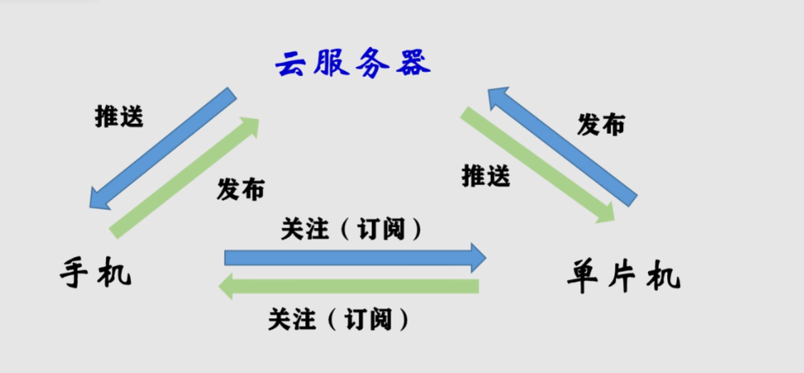
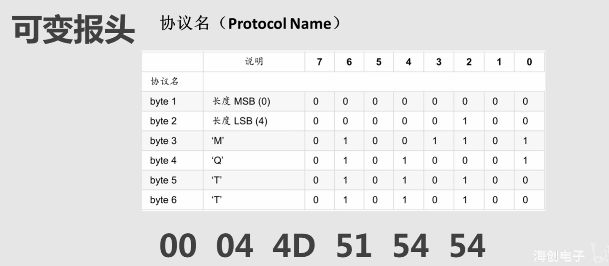
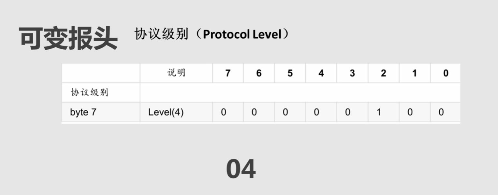
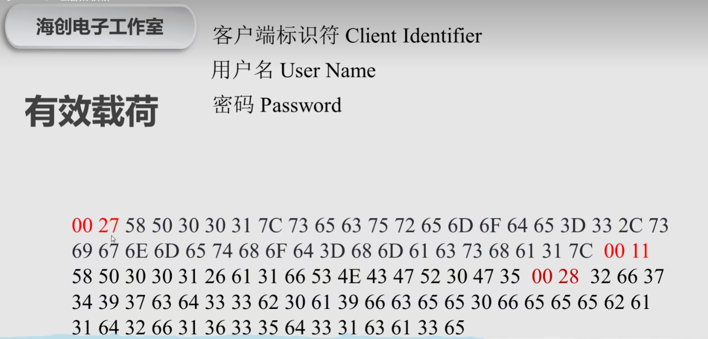
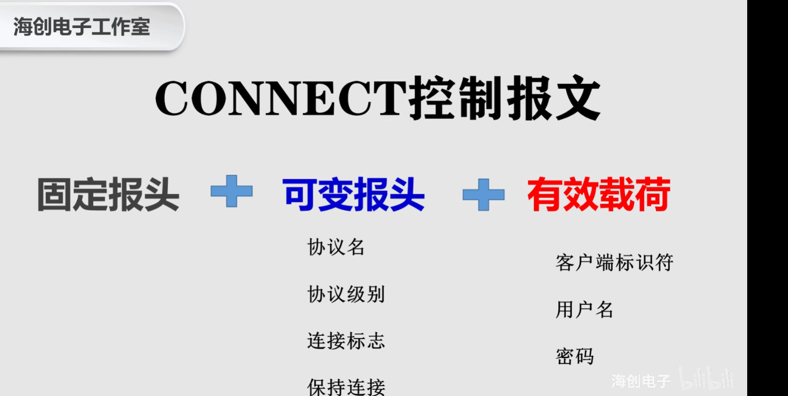

# MQTT  迈向物联网的第一步 

MQTT是一款协议
MQTT.fx是一个工具

可以去阿里云大学里听课

基本概念
https://help.aliyun.com/zh/iot/product-overview/terms?spm=a2c4g.11186623.0.0.343e747d9KJau4

产品：设备的集合，通常指一组具有相同功能的设备

设备：归属于某些产品下的具体设备

topic：topic是utf-8字符串，是发布（pub）和订阅（sub）消息的传输中介。可以向topic发布或者订阅消息 （类似于微博的用户名）
topic类：同一产品下不同设备的Topic集合 用${productKey}和${deviceName} 通配一个唯一的设备，一个Topic类对一个productKey下所有设备通用

创建产品和项目（把下图实现）

 

## connect控制报文协议详解  
固定报头+可变报头+有效载荷 

固定报头：必须存在，用于描述报文信息，里面有指出什么类型的报文，报文的等级
可变报头：不一定存在，主要是要看什么样子类型的报文
有效载荷部分： 这是内容，可是通信信息的存放的地方，只是有时候还会存放一些额外的信息，如客户ID

这些都是字符串，传输的时候是要二进制传输，但是咱们看的时候 是十六进制的看 

固定报头（只需要两个字节）

可变报头（共十个字节，基本固定）
    协议名 （六个字节）

    协议级别（一个字节）

    连接标志（只有第零位是固定的）

    保持连接（两个字节）

有效载荷（都是有固定格式的）
    客户端标识符
    用户名
    密码

    标红的是协议要求 要在前面加上两字节的内容长度
*:设备名称 #:productKey   * 表示设备名称，# 表示productKey
密码需要经过哈希加密才行  可以去在线哈希网址进行加密  密钥里填deviceSecret

    这两个问号是剩余长度（即问号后面有几个字节 ？？ 这个不确定） 也要填上去的

网络调试助手 这是个客户端工具

剩余长度：表示当前报文剩余部分的字节数，包括可变报头和负载的数据

## 订阅主题

subscribe报文  客户端向服务端订阅
作用
    1. 服务端发送publish报文给客户端
    2. subscribe报文制定了最大的QoS等级

> 订阅报文 是客户端向服务端订阅

固定报头（两字节）
可变报头
有效载荷
    主题过滤器  Qos等级
