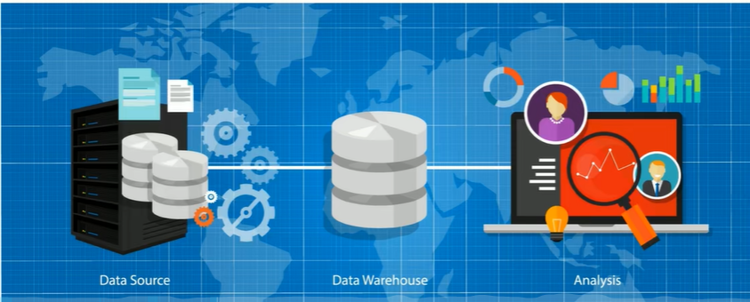
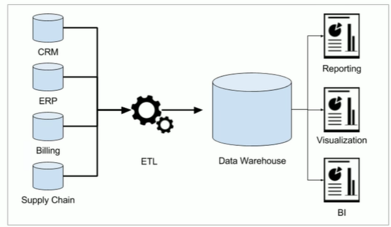
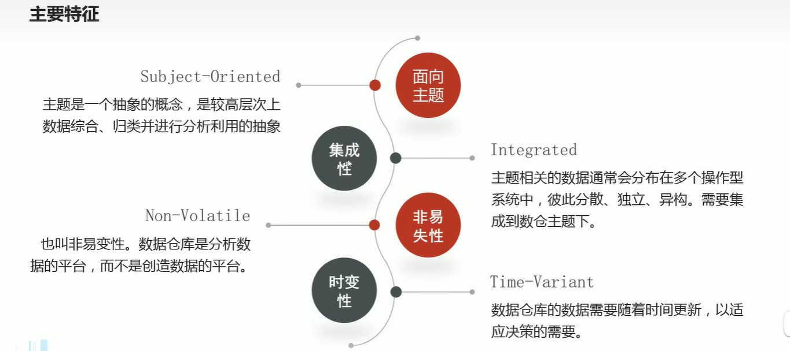
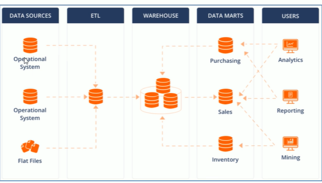
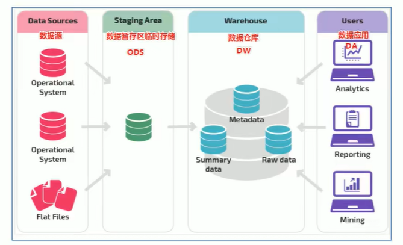

# Hive

## 概念
数据仓库（data warehouse 简称数仓 DW），是一个用于存储，***分析***，报告的数据系统
数据仓库的目的是构建面向分析的集成化数据环境，分析结果为企业提供决策支持

数据仓库本身并不生产任何数据，其数据来源于不同的外部系统
同时数据仓库自身也不需要消费任何的数据，其结果开放给各个外部应用使用
这也是为什么叫仓库而不叫工厂的原因

数仓为何而来：为了分析数据而来，分析结果给企业决策提供支撑

1. 操作型记录的保存
   关系型数据库：oracle、mysql、sql server等

数据库可以进行数据分析吗：可以 但是没必要
数据库读的压力比较大，如果在开展数据分析，会让读取压力倍增
数据仅存储数周或数月的数据
数据分散在不同系统不同表中，字段类型属性不统一

## 数据仓库主要特征

## OLTP系统:面向业务，支持事物  OLAP系统:面向分析，支持分析

## 数据仓库、数据集市
数据仓库是面向整个集团组织的数据，数据集市是面向单个部门使用的
可以认为数据集市是数据仓库的子集，也有人把数据集市叫做小型数据仓库。数据集市通常只涉及一个主题领域，
他们较小且更具体，所以他们通常更易于管理和维护，并具有更灵活的结构

## 数据仓库的分层架构
理论上分为三个层  操作型数据层（ODS），数据仓库层（DW），数据应用层（DA）

## ETL、ELT区别

