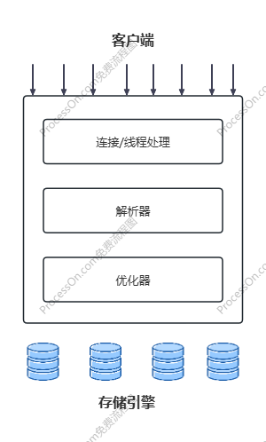
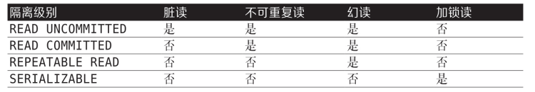
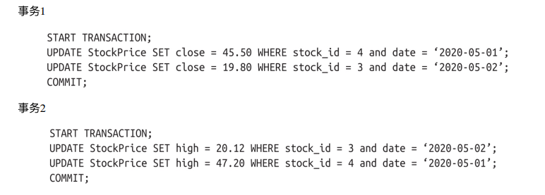
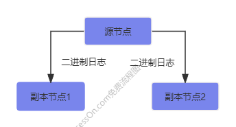
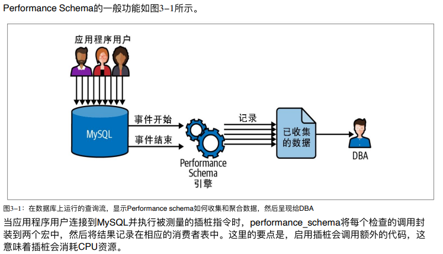
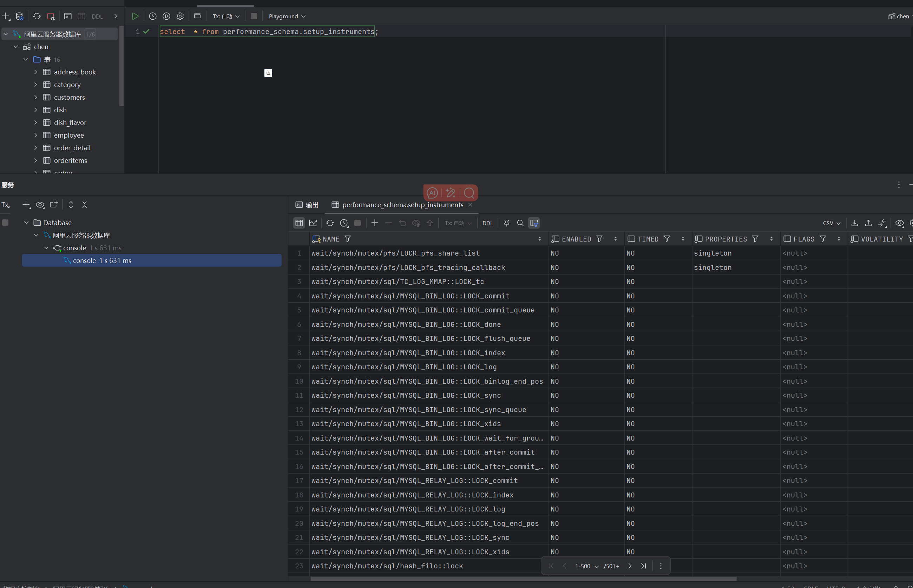

# 高性能MySQL读后感 

# 第一章
## MySQl服务器架构-逻辑视图

## 连接管理与安全性
默认情况下，每个客户端都会在服务器进程中拥有一个线程，该连接的查询只会在这个单独的线程中执行，该线程驻留在一个内核或者CPU上。服务器为了一个缓存区，用于存放已就绪的线程，因此不需要为每个新的连接创建或销毁线程

## 并发控制
处理并发读/写访问的系统通常实现一个由两种锁类型组成的锁系统，这两种锁通常被称为***共享锁*** ***排它锁*** 也叫***读锁*** ***写锁***

资源上的读锁石共享的，或者说是互不阻塞的，多个客户端可以同时读取一个资源而不受干扰。
写锁则是排他的，一个写锁既会阻塞读锁也会阻塞其他写锁，这是出于安全策略的考虑，只有这样才能确保在特定的时间点只有一个客户端能够执行写入，并防止其他客户端读取正在写入的资源
在实际的数据库系统中，每时每刻都在发生锁定

### 锁的颗粒度
一种提高共享资源并发性的方式就是让锁定对象更有选择性，尽量只锁定包含需要修改的部分数据，而不是所有资源，更理想的方式是只对需求修改的数据片段进行精确的锁定。
问题是加锁也需要消耗资源。锁的各种操作，获取锁，检查锁是否空闲，释放锁等都会增加系统的开销
锁定策略是锁开销和数据安全性之间的平衡，大多数商业数据库系统没有提供太多的选择，一般都是在表中施加***行级锁***
锁是数据库实现一致性保证的方法。
MySQL提供了多种选择，每种MySQL存储引擎都可以实现自己的锁策略和锁颗粒度。下面来看两种最重要的锁策略

#### 表锁
表锁是MySQL中最基本也是开销最小的锁策略，表锁类似于前文描述的电子表格的锁机制，他会锁定整个表，当客户端想要对表进行写操作（插入，删除，更新等）时，需要先获取一个***写锁***
这会***阻塞其他客户端对该表的所有读写操作***，只有没有人执行写操作时，其他读取的客户端才能获得读锁，***读锁之间不会相互阻塞***即多个客户端可以同时持有读锁，并同时读取数据，但是***如果某个客户端有读锁，其他客户端无法获取写锁***，直到所有读锁释放
写锁队列于读锁队列是分开的，但是写锁队列的优先级绝对高于读队列

#### 行级锁
使用行级锁可以最大程度地支持并发处理（也带来了最大的锁开销），行级锁实在存储引擎而不是在服务器中实现的，服务器通常不清楚存储引擎中锁的实现方式。每种存储引擎都以自己的方式来实现锁

## 事务
事务就是一组SQL语句，作为一个工作单元以原子方式进行处理。如果数据库引擎能够成功的对数据库应用整组语句，那么就执行该组语句。如果其中有任何一条语句因为崩溃或者其他原因无法执行，那么整组语句都不执行，
也就是说作为事务的一组语句，要么全部执行成功，要么全部执行失败
***start transaction*** 语句启动事务
原子性-要么全部失败，要么全部成功
一致性-数据库总是从一个一致性状态转换到下一个一致性状态。如果事务最终没有提交，该事务所做的任何修改都不会被保存到数据库当中
隔离性-一个事务所做的修改在最终提交以前，对其他事务是不可见的
持久性-一旦提交，事务所做的修改就会被永久保存到数据库中

ACID事务和InnoDB引擎提供的保证是MySQL中最强大，最成熟的特征之一，虽然他们在吞吐量方面做了一定的权衡，但如果应用得当，就可以避免在应用层实现大量复杂逻辑

### 隔离级别
ANSI SQL标准定义了4种隔离级别，这个通用标准的目标是定义在事务内外可见和不可见的更改的规则

#### 未提交读（脏读）
在事务中可以查看其他事务中还没有提交的数据，***这个隔离级别会导致很多问题***，性能上不会比其他级别好太多，但是却缺乏其他级别的好处，在实际应用中一般很少使用

#### 提交读（大多数数据库系统的默认隔离级别就是提交读）但MySQL不是
一个事务可以看到其他事务在他开始之后提交的修改，但在该事务提交之前，其所做的任何修改对其他事务都是不可见的，***但同时意味着同一事物执行两次，可能会看到不同的数据结果***

#### 可重复读
保证了在同一事务中多次读取相同行数据的结果是一样的，但是无法解决***幻读问题*** 幻读就是当某个事物在读取某个范围内的记录时，另一个事务又在该范围内插入了新的记录，会产生幻行

幻读与不可重复读的区别
不可重复读：同一事物内多次读取同一数据，结果不一样 （单个数据）
幻读：同一事务内多次读取同一范围的数据，结果集不一致 （批量数据）

#### 可串行化
是最高的隔离级别，通过***强制事务按照顺序执行***，使不同事务之间不可能产生冲突，而且解决了前面说的幻读问题，可串行化会在读取的每一行数据上都加锁，所以可能导致大量的
超时和锁征用问题。实际应用中很少用到这个隔离级别，除非需要严格确保数据安全且可以接受并发性能下降的结果

### 隔离级别表格总结

### 死锁
死锁是指两个或多个事务相互持有和请求相同资源上的锁，产生了循环依赖。当多个事务视图以不同的顺序锁定资源时会导致死锁。

每个事务都执行第一个查询，在处理过程中会更新一行数据，同时在主键索引和其他唯一索引中将该行锁定，每个事务在执行第二条语句时发现改行已经被锁定，这两个事务将永远等待对方完成。
为了解决上面出现的问题，数据库系统实现了各种死锁检测和锁超时机制，比如InnoDB，检测到循环依赖后会立即返回一个错误信息，还有一种方式锁等待超时的时间限制后，终止查询，将持有最少行级排他锁的事务回滚（这是一种最容易回滚的近似算法）
锁的行为和顺序是和存储引擎相关的，同样一系列查询语句，有些存储引擎会产生死锁，有些则不会。
死锁的产生有双重原因：有些是因为真正的数据冲突，这种情况很难避免，有些则完全由于存储引擎的实现方法导致的。
一旦发生死锁，如果不回滚其中一个事务（部分或全部），就无法打破死锁

## MySQL中的事务
这里描述的事务原语将基于InnoDB引擎中的事务

### 理解autocommit
默认情况下，单个insert update delete语句会被隐式包装在一个事务中并执行成功后立即提交，这成为自动提交（autocommit）模式。通过禁用此模式，可以在事务中执行一系列语句，
并在结束时执行commit提交事务或者rollback回滚事务
建议最好在服务器级别设置最常用的隔离，并且只在显示情况下修改。

### 在事务中混合使用存储引擎
MySQL不在服务器层管理事务，事务是由下层的存储引擎实现的。所以在同一个事务中，混合使用多种存储引擎是不可靠的
假设在事务中混合使用事务表和非事务表，如果需要回滚，则无法撤销对非事务表的更改，这样会使数据库处于不一致的状态，可能很难恢复，并使整个事务问题变得毫无意义，
所以为每张表选择合适的存储引擎，并不惜一切代码避免在应用中混合使用存储引擎是非常重要的

## 多版本并发控制（MVCC，需要再次深挖）
MySQL的大多数事务型存储引擎使用的都不是简单的行级锁。他们会将行级锁和可以提高并发性能的多版本并发控制技术结合使用
可以认为MVCC是行级锁的一个变种，但是他在很多情况下避免了加锁操作，因此开销更低。根据其实现方式，不仅实现了非阻塞的读操作，写操作也锁定必要的行
MVCC的工作原理是使用数据在某个时间点的快照来实现的。这意味着，无论事务运行多长时间，都可以看到数据的一致视图，但也意味着不同的事务可以在同一时间看到同一张表中的不同数据！！
每个存储引擎实现MVCC的方式都不同，其中一些变体包括乐观并发控制和悲观并发控制

## 复制
MySQL被设计用于在任何给定时间只在一个节点上接受写操作，这在管理一致性方面具有优势，但在需要将数据写入多台服务器或多个地区时，会导致需要做出取舍。MySQL提供了一种原生方式来将一个节点执行的写操作分发到其他节点，
这被称为复制。在MySQL中，源节点为每个副本节点提供一个线程，该线程作为复制客户端登录，当写入发生时会被唤醒，发送新数据。下面是一主多副的多个MySQL服务器拓扑图

对于在生产环境中运行的任何数据，都应该使用复制并至少有三个以上的副本，理想情况下应该分布在不同的地区，用于容难恢复计划

## InnoDB引擎
InnoDB是MySQL的默认事务型存储引擎，也是最重要，使用最广泛的引擎，也是最重要，使用最广泛的引擎。他是为处理大量短期事务而设计的，这些事务通常是正常提交的，很少会被回滚。InnoDB的性能和自动崩溃恢复特性，使得他在
非事务型存储需求中也很流行。

# 第二章 可靠性工程世界中的监控（这一章节看的很少）

#### 监控解决方案
依赖一些工具
商业选项：
    SolarWinds数据库性能管理工具
开源选项：
    Percona监控和管理工具是一个成熟的开源选项
    最后使用Performance Schema来分析MySQL的性能对我们会有很大帮助

# 第三章 Performance Schema
Performance Schema是MySQL数据库中的一个内置的系统数据库，最早从5.5版本开始，这个数据库主要用于收集和存储与数据库性能相关的统计信息和指标
使用它可以帮助运维人员对数据库性能监控、调优和故障排查提供依据

## 介绍
Performance Schema 提供了有关MySQL服务器内部运行的操作上的底层指标，先介绍两个概念

### 插桩
程序插桩在MySQL代码中插入探测代码，以获取我们想了解的信息，例如如果想收集关于元数据锁的使用情况，需要启用wait/lock/meta-data/sql/mdl这个插桩

### 消费者表
指的是存储关于程序插桩代码信息的表，如果我们为查询模块添加插桩，相应的消费者表将记录诸如执行总数、未使用索引的次数、花费的时间等信息，大多数人都将消费者表与Performance Schema 紧密联系在一起

### 插桩元件
在Performance_schema中（他其实就是个数据库）,setup_instruments表包含所有支持插桩的列表

### 消费者表的组织
消费者表是插桩发送信息的目的地。测量结果存储在Performance Schema数据库的多个表中

# 第四章 操作