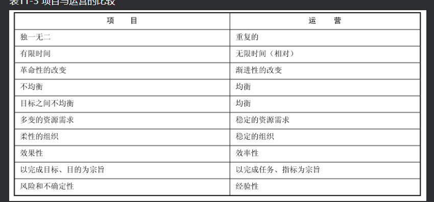
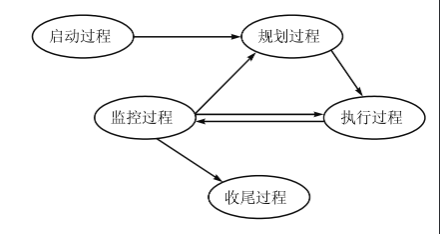
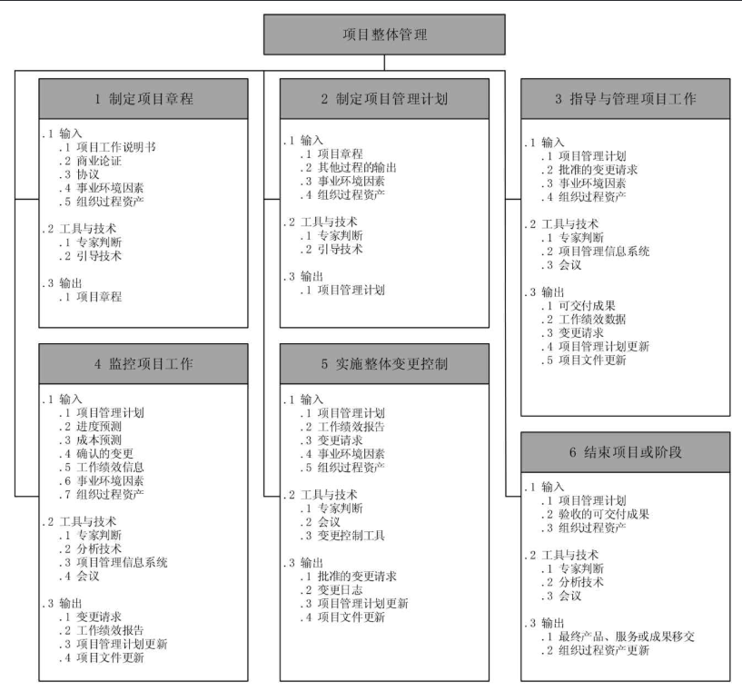
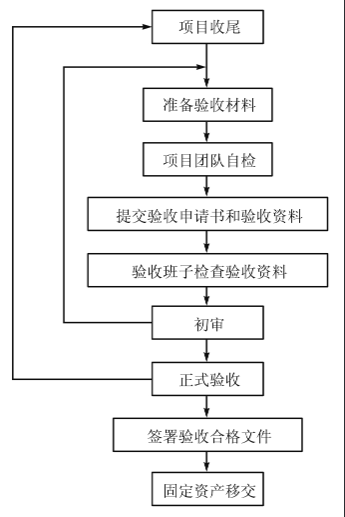

# 信息系统项目管理师考试辅导教程

## 第十一章 信息系统项目管理基础

### 六大基本属性
1. 临时性（一次性）
2. 独特性
3. 渐进明细性
4. 目标的确定性
5. 组织的临时性和开放性
6. 成果的不可挽回性

### 项目管理的四大要素
1. 环境
2. 资源
3. 目标
4. 组织

### 信息系统项目的特点
1. 高智力密集性
2. 综合性
3. 高投入，高风险，高收益
4. 高度时效性: 产品生命周期越来越短
5. 高度竞争性
6. 信息交流必不可少
7. 目标柔韧性
8. 团队重要性
9. 过程重要性

### 十大管理
1. 范围管理
2. 时间管理
3. 成本管理
4. 质量管理
5. 人力资源管理
6. 沟通管理
7. 风险管理
8. 采购管理
9. 干系人管理
10. 整合管理

运营：企业日常的生产产品的活动
项目：一次性活动

## 第十二章 项目生命周期和组织

### 项目生命周期
1. 概念阶段
2. 开发阶段
3. 实施阶段
4. 结束阶段

### 项目团队的发展阶段
1. 形成期
2. 震荡期
3. 正规期
4. 表现期

## 第十三章 项目管理过程
项目是由一系列过程来实现的，可以将项目管理活动视作一系列相互联系的过程

### 项目管理的五个阶段
1. 启动过程
2. 规划过程
3. 执行过程
4. 监控过程
5. 收尾过程

## 第十四章 项目立项与招投标管理

## 第十五章 项目整体管理
范围，进度，成本，时间，质量，干系人，采购，沟通，风险，人力资源几个方面

### 项目章程
项目启动过程明确指定这一过程有一个重要的输出文档--项目章程，项目章程是正式授权一个项目和项目资金的文件
，由项目发起人或者项目组织之外的主办人颁发

### 项目管理计划的内容
1. 工作计划
2. 人员组织计划
3. 设备采购供应计划
4. 其他资源供应计划
5. 变更控制计划
6. 进度计划
7. 成本投资计划
8. 文件控制计划
9. 支持计划

### 变更申请（CR）
### 变更评审（CCB 变更控制委员会）
### 变更分派
### 变更实施
### 变更验证

### 项目收尾（百分之44）
项目收尾包括合同收尾和管理收尾两部分

合同收尾就是按照合同约定，项目组和业主一起进行核对，查看是否可以把项目结束掉
管理收尾是对于内部来说，把做好的项目文档等归档，对外宣称项目已经结束，转入维护期，把相关的产品说明转到维护组，同时进行经验教训总结

## 第十六章 项目范围管理
项目的范围管理影响到项目系统的成功
“需求蔓延”至少还有两个原因：一个是项目组也从来不知道项目的范围是什么，什么是项目应该做的，什么是项目不应该做的。
其次是许多信息系统的项目组从来没有使用任何有效方式和过程来控制范围的变化。
在信息系统项目中，实际上存在两个相互关联的范围
1. 产品范围：指信息系统产品或者服务所应该包含的功能，产品范围是项目范围的基础
2. 项目范围：项目范围的定义是产生项目计划的基础，更偏向于管理。判断项目范围是否完成，要以项目管理计划、项目范围说明书、工作分解结构、

### 规划范围管理

## 第十七章 进度管理
项目管理是一个带有创造性的过程，项目不确定性很大，项目的进度控制是项目管理中的最大难点。
